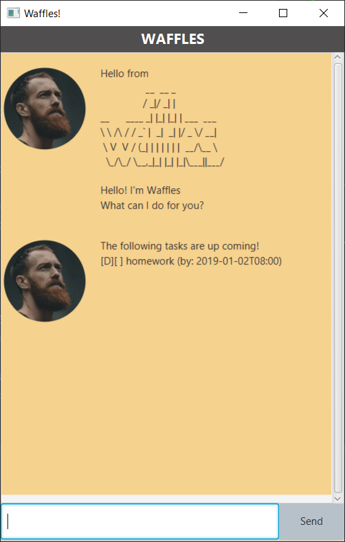

# Waffles
> The best things in life are waffles.

🧇 An *alternative* to [Duke](https://github.com/nus-cs2103-AY2223S2/ip). 🧇

Are you looking for task manager that not only remind you of your tasks, but also is:
1. **Distraction Free**
2. Text-based
3. Portable
4. Open Sourced

Waffles got you covered.

### Features:
- [x] Keeps tracks of your tasks
- [x] Reminders



### Download:
* [Download](https://github.com/9fc70c892/ip)

---
If you are a Java programmer, you can experiment or add on to our [Source Code](https://github.com/9fc70c892/ip/)!

```Java
public class Main {
    public static void main(String[] args) {
        core.Duke.main(args);
    }
}
```
# User Guide:

## Add

### Todo
Add a to do task.

Usage: `todo [description]`

Example:
> todo Homework

### Deadline
Add a deadline task.

Usage : `deadline [description] /by [yyyy/MM/dd HHmm]`

Example:
> deadline homework /by 2022/10/05 1000

### Event
Add an event task.

Usage : `event [description] /from [yyyy/MM/dd HHmm] /to [yyyy/MM/dd HHmm]`

Example:
> event Gymkhana filming with Ken /from 2018/11/20 1000 /to 2018/11/24 1800

## List / Find
### List
Returns a list of all tasks

Usage : `list`

### Find
Finds tasks that contain a particular keyword (not case sensitive).

Usage : `find [keyword]`

Example:
> find work

Output:
> All tasks containing the word 'work'

## Mark
### Mark
Marks a particular task as completed.
This integer is based on the value provided by `list` command

Usage: `mark [integer]`

Example:
> mark 1

### Unmark
Marks a particular task as incomplete.
This integer is based on the value provided by `list` command

Usage: `unmark [integer]`

Example:
> unmark 1

## Delete
### Delete
Deletes a particular task.
This integer is based on the value provided by `list` command

usage: `delete [integer]`

Example:
> delete 1


## Load / Save
### Load
Loads save file that contains the list.

Usage : `load`

### Save
Saves the current list into a file.

Usage : `save`
