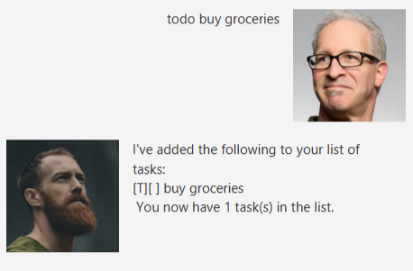
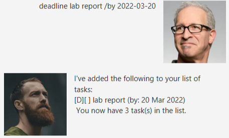
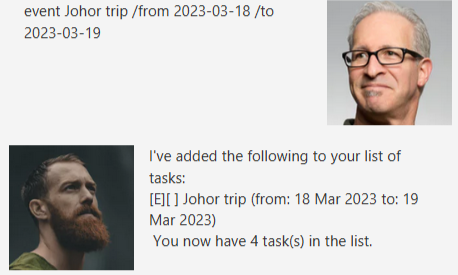
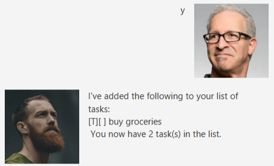
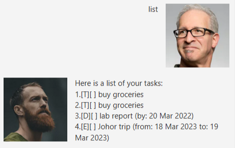
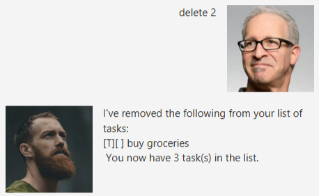
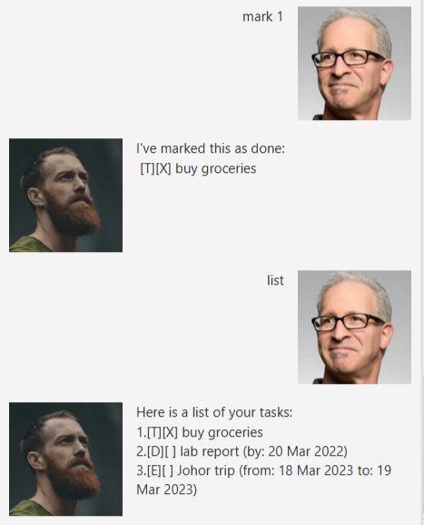
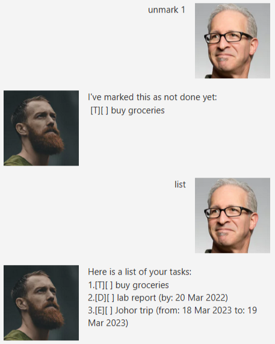
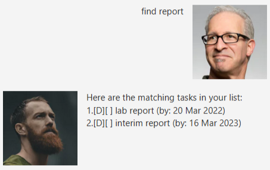

# User Guide

## Features 
Duke supports several features to manage your list of tasks. Its relevant usages are presented in the `Usage` section below.

### 1. Adding of tasks

Creating a new task and adding it to your list of tasks.

### 2. Viewing your tasks

Shows you your list of tasks.

### 3. Deletion of tasks

Deletes an existing task in your list.

### 4. Marking task completion

Duke can mark a task as completed or yet to be completed

### 5. Search by name

Duke searches your list of tasks and returns a list of tasks whose names matches what you were searching for.

### 6. Duplicate detection

Duke is able to identify when you are adding a task with a similar name to one that already exists in your list, and will prompt for user confirmation to add this new task to the list.

## Usage

### `todo (name)` - Adds a todo to your list of tasks.

Duke creates a new "Todo" task with the given `name` and adds it to your list of tasks.

Example of usage: 

`todo buy groceries`

Expected outcome:

### `deadline (name) /by (YYYY-MM-DD)` - Adds a task with the given deadline to your list

Similarly to `todo`, Duke creates a task with the deadline specified after the `/by` command. 

*Note: Enter the date in the specified format (YYYY-MM-DD)*

Example of usage:

`deadline lab report /by 2022-03-20`

### `event (name) /from (YYYY-MM-DD) /to (YYYY-MM-DD)` - Creates and adds an event with a start date and end date

Duke creates and adds an event to your list of tasks with the start date that is specified after the `/from` command and
an end date specified after the `/to` command

*Note: Enter the date in the specified format (YYYY-MM-DD)*

Example of usage:

`event Johor trip /from 2023-03-18 /to 2023-03-19`

### Duplicate detection

If a task with the same name already exists in your list, Duke will prompt you for a confirmation to add the new task into the list.

At this point, Duke expects a `yes` or `no` response (or you can enter `y` or `n` for short)

### `list` - Shows your list of tasks

Example of usage:

`list`

### `delete (num)` - Deletes a task with task number `num` from your list

Example of usage:

`delete 2`

### `mark (num)` - Marks a task with task number `num` as completed

Example of usage:

`mark 1`

### `unmark (num)` - Marks a task with task number `num` as not yet completed

Similarly to mark, this removes the mark from tasks that have already been marked as completed.

Example of usage:

`unmark 1`

### `find (token)` - Returns a list of tasks that includes the input `token` in its name

Example of usage:

`find report`

### `bye` 

Once you are done using Duke, be sure to say `bye` because it would be rude not to.

