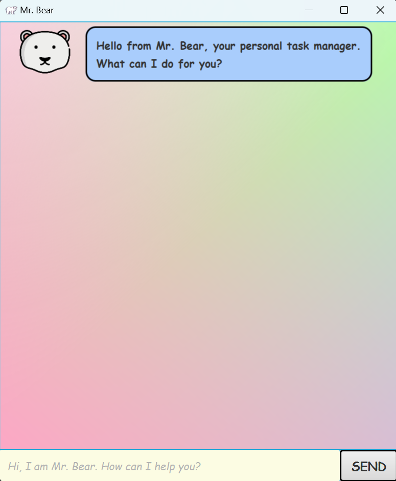

# User Guide to Mr. Bear!

- [Introduction](#introduction)
- [Quick Start](#quick-start)
  - [Run the project in terminal](#run-the-project-in-terminal)
  - [Run the project in intelliJ](#run-the-project-in-intellij)

- [Command Summary](#command-summary)
- [Features](#features)
  * [Adds Todo Tasks](#adds-todo-tasks)
  * [Adds Deadline Tasks](#adds-deadline-tasks)
  * [Adds Event Tasks](#adds-event-tasks)
  * [Adds Fixed Duration Tasks](#adds-fixed-duration-tasks)
  * [Updates Tasks](#updates-tasks)
  * [Lists All Tasks](#lists-all-tasks)
  * [Mark Tasks as Done](#mark-tasks-as-done)
  * [Unmark Tasks](#unmark-tasks)
  * [Delete Tasks](#delete-tasks)
  * [Find Tasks](#find-tasks)
  * [Find Next Free Day](#find-next-free-day)
  * [Mass Delete Done Tasks](#mass-delete-done-tasks)
  * [Sort Tasks by Category](#sort-tasks-by-category)
  * [View Tasks on a Given Date](#view-tasks-on-a-given-date)
  * [Bye](#bye)
- [Miscellaneous](#miscellaneous)
  * [Acceptable Formats for `<DateTime>`](#acceptable-formats-for---datetime--)
  * [Acceptable Formats for `<Date>`](#acceptable-formats-for---date--)
  * [Acceptable Formats for `<Duration>`](#acceptable-formats-for---duration--)
- [Useful Resources](#useful-resources)

## Introduction
The Mr. Bear Application is a chatbot designed to assist users with various tasks, made by [Zhu Yufan](https://www.linkedin.com/in/yufan-zhu-36024a225/) under the module CS2103T 2022/23 Sem 2. 

This project, Mr. Bear, is based on [Project Duke](https://github.com/nus-cs2103-AY2223S2/ip) and is an educational tool that helps new software developers improve their skills through the gradual construction of the project and the discovery of various software engineering principles.

This is a simple user guide for the usage of Mr. Bear Application.

## Quick Start
### Run the project in terminal

1. Download the latest  **Mr.Bear.jar** file from [here](https://github.com/Yufannnn/ip/releases)
2. Navigate to any empty folder and place the downloaded file into that folder.
3. Navigate your terminal directory to the folder that contains your **Bill.jar** file
4. To launch the Mr. Bear Application, you have two options:
    * Double-click the "Mr.Bear.jar" file on your device.
    * Open the command prompt and enter the command:
        ```
        java -jar Mr.Bear.jar
        ```
        If you prefer a Command Line Interface, type:
        ```
        java -jar Mr.Bear.jar -cli 
		```
5. You should expect the Graphical User Interface (GUI) to appear in a matter of seconds.
6. You should expect to see a window as shown below: 



7. When the application is running, enter the "help" command to view a list of available commands and learn the tasks that the chatbot can help with.
```
help
````

### Run the project in intelliJ

> **Prerequisites**
>
> + JDK 11
> + update Intellij to the most recent version.

1. Open Intellij.
2. If you are not on the welcome screen, navigate to "File" > "Close Project" to close any existing projects.
3. At this point, you should be seeing the welcome screen and be able to either import a project or open one.
4. Set up the correct JDK version, as follows:
	1. Launch Intellij and select "Configure" from the welcome screen or navigate to "File" > "Project Structure".
	2. Once in the Project Structure window, click on "Project" and choose "Project SDK" from the drop-down menu.
	3. In the SDKs section, confirm that JDK 11 is selected. If it's not present, click on "New..." and locate the JDK 11 installation on your system.
	4. Pick the correct version and press "OK" to set it as the default SDK for your project.
	5. Click "Apply" and "OK" to save the changes and exit the Project Structure window.

3. Here are the steps to import the project into Intellij:
	1. Start Intellij and go to "File" > "Open" or "File" > "Import Project".
	2. Find the project folder, select the root directory of the project, and click "OK".
	3. The project will be imported and the necessary build and indexing will occur automatically. If any configuration or dependencies are prompted, accept the default options.
	4. Upon completion of the import, the project should be fully functional for running and debugging within Intellij.


4. After the import is completed, you can access the src/main/java/Launcher.java file. To run it, simply right-click on it and choose the option "Run Launcher".

5. If the setup was successful, the graphical user interface should appear shortly.

6. You can now type in your command and press Enter to run it.


## Command Summary

| Index | Command to Use | Format | examples |
| :---: | :----------: | :-----------: | :----------: |
| 1 | Adds a Deadline task | `deadline <Description> /by <DateTime>` | `deadline homework /by 16/01/2023 1500` |
| 2 | Adds an Event task | `event <Description> /from <DateTime> /to <DateTime>` | `event homework /from 16/01/2023 1500 /to 16/01/2023 1900` |
| 3 | Adds a Fixed Duration task | `fixed <Description> /within <Duration>` | `fixed homework PT2H` |
| 4 | Adds a Todo task | `todo <Description>` |`todo homework`|
| 5 | Deletes a Task | `delete <TaskIndex>` | `delete 1` |
| 6 | Finds Tasks according to description | `find <Description...>` | `find homework`, `find homework meeting exercise` |
| 7 | Finds the next free day in the next month | `free` | `free` |
| 8 | Lists out all Tasks | `list` |`list` |
| 9 | Marks a Task as done | `mark <TaskIndex>` | `mark 1` |
| 10 | Mass deletes all the done Tasks | `massDelete` | `massDelete` |
| 11 | Shows help menu | `help` | `help` |
| 12 | Sorts all the events by Categories | `sort` | `sort` |
| 13 | Unmarks a Task | `unmark <TaskIndex>` | `unmark 1` |
| 14 | Updates the description of a Task| `update <TaskIndex> <Description>` | `update 1 Do Assignment 1` |
| 15 | Views the Tasks on a given date | `view <Date>` | `view 16/01/2023` |
| 16 | Ending a session | `bye` | `bye` |


## Features

### Adds Todo Tasks
The `todo <Description>` command allows you to easily add a Todo task to your task list. It takes in a single argument, which is the description of the task.

For example, running the command, `todo homework`,  would add a Todo task with the description "homework" to your task list and return the following output:

>Got it. I've added this task:
>
>\[T][ ] homework
>
>Now you have 5 tasks in the list.

### Adds Deadline Tasks
The `deadline <Description> /by <DateTime>` command allows you to add a Deadline task to your task list. It takes in two arguments, the first is the description of the task and the second is the deadline of the task in the format of `/by <DateTime>`.

For example, running the command, `deadline homework /by 16/01/2023 1500`, would add the task "homework" to your task list with a deadline of January 16th, 2023 at 3:00pm and return the following output:

>Got it. I've added this task:
>
>\[D][ ] homework ( by: Jan 16 2023 15:00 )
>
>Now you have 5 tasks in the list.

### Adds Event Tasks
The `event <Description> /from <DateTime> /to <DateTime>` command allows you to add an Event task to your task list. It takes in three arguments, the first is the description of the task, the second is the start time of the event in the format of `/from <DateTime>`, and the third is the end time of the event in the format of `/to <DateTime>`.

For example, running`event homework /from 16/01/2023 1500 /to 16/01/2023 1900`, would add the task "homework" as an event to your task list with a start time of January 16th, 2023 at 3:00pm and end time of January 16th, 2023 at 7:00pm and return the following output

> Got it. I've added this task:
>
> \[E][ ] homework ( from: Jan 16 2023 15:00 to: Jan 16 2023 19:00 )
>
> Now you have 7 tasks in the list.


### Adds Fixed Duration Tasks
The `fixed <Description> /within <Duration>` command allows you to add a task with fixed duration to your task list. It takes in two arguments, the first is the description of the task and the second is the duration of the task in the format of `/within <Duration>`.

For example, running the command, `fixed homework /within 2`, would add the task "homework" to your task list with a duration of 2 hours and return the following output: 

> Got it. I've added this task:
>
> \[F][ ] homework ( duration: 2h )
>
> Now you have 5 tasks in the list.

### Updates Tasks
The `update <TaskIndex> <Description>` command allows you to update the description of a task in your task list. It takes in two arguments, the first is the index of the task you want to update, and the second is the new description.

For example, running the command, `update 1 Do Assignment 1`, would update the task with index 1 to be "Do Assignment 1" and return the following output: 

> Nice! I've updated the description of this task:
>
> \[D][ ] Do Assignment 1 ( by: Jan 15 2021 03: 00 )

### Lists All Tasks
The `list` command allows you to view all tasks in your task list. It takes in no arguments and will show the description, deadline (if any), and start and end time (if any) for each task in the list. 

For example, running the command `list` will show the content of the list return the following output:

> 1. \[D][ ] homework ( by: 16/01/2023 1500 )
> 2. \[E][ ] meeting ( from: 16/01/2023 1500 to: 16/01/2023 1700 )
> 3. \[T][X] grocery shopping

### Mark Tasks as Done
The `mark <TaskIndex>` command allows you to mark a task as done in your task list. It takes in one argument, the index of the task you want to mark as done.

For example, running the command, `mark 1`,  would mark the task "homework" as done and return the following output:

> Nice! I've marked this task as done:
>
> \[D][X] Do Assignment 1 ( by: Jan 15 2021 03: 00 )


### Unmark Tasks
The `unmark <TaskIndex>` command allows you to unmark a task that you previously marked as done. It takes in a single argument which is the index of the task you want to unmark.

For example: running the command, `unmark 1`,  would unmark the task previously marked as done at index 1 and return the following output:

> Ok, I've marked this task as not done yet:
>
> \[D][ ] Do Assignment 1 ( by: Jan 15 2021 03: 00 )

### Delete Tasks
The `delete <TaskIndex>` command allows you to delete a task from your task list. It takes in a single argument which is the index of the task you want to delete.

For example: running the command, `delete 1`, would unmark the task previously marked as done at index 1 and return the following output:

> Ok, I've removed this task:
>
> \[D][X] Do Assignment 1 ( by: Jan 15 2021 03: 00 )
>
> Now you have 8 tasks in the list.

### Find Tasks
The `find <Description...>` command allows you to find tasks in your task list based on their descriptions. It takes in one or more arguments which are the keywords you want to search for,

For example, running the command `find homework`, will find all the task with description that matches or partially matches the word homework and return the following output: 
> Here are the tasks matching "homework":
>
> 1. \[D][ ] homework ( by: 16/01/2023 1500 )
> 2. \[T][ ] Do homework for math class
> 3. \[T][ ] Read chapter 2 and do the homework exercises

running the command `find homework eat meeting`, will find all the tasks with description that matches or partially matches each input description and return the following output: 
> Here are the tasks matching "homework":
>
> 1. \[D][ ] homework ( by: 16/01/2023 1500 )
> 2. \[T][ ] Do homework for math class
> 3. \[T][ ] Read chapter 2 and do the homework exercises
> 
>   Here are the tasks matching "eat":
>
> 1. \[D][ ] eat breakfast ( by: 16/01/2023 0900 )
> 2. \[T][ ] eat chicken breast
> 
>   Here are the tasks matching "meeting":
>
> 1. \[E][ ] project team meeting ( from: 17/01/2023 1500 to 17/01/2023 1700 )

### Find Next Free Day
It takes in no arguments, and will return the next available day in the next month with no tasks or events scheduled on it. 

For example, running the command `free` will return the following output:
> Next free day: 02/15/2023

### Mass Delete Done Tasks
The `massDelete` command allows you to delete all the done tasks in your task list.

For example, running the command `free` will return the following output:
> I have deleted all the tasks that have been marked as done.

### Sort Tasks by Category
The `sort` command allows you to sort all the events in your task list by categories.

For example, running the command, `sort`, will return the following output:
> Here are all your Deadline Task:
> 1. \[D][ ] grade all students' homework ( by: Jan 16 2023 15:00 )
> 2. \[D][ ] do Assignment 1 ( by: Jan 19 2023 23:59 )
> 
> Here are all your Event Task:
> 1. \[E][ ] project team meeting ( from: Jan 17 2023 15:00 to Jan 17 2023 17:00 )
> 
> Here are all your Fixed Duration Task:
> 1. \[F][X] exercise ( duration: 1h )
> 2. \[F][ ] Coding Time Practice ( duration: 2h )
> 
> Here are all your Todo Task:
> 1. \[T][ ] manage hoemework files
> 2. \[T][ ] buy milk
> 3. \[T][ ] mop the floor

### View Tasks on a Given Date
The `view <Date>` command allows you to view all the tasks on a given date. It takes in a single argument which is the date in the format of DD/MM/YYYY.

For example, runing the command, `view 16/01/2023` would display all tasks on January 16th, 2023 and return the following output: 
> Here are the tasks on the specified date:
> 1. \[D][ ] grade homework of students ( by: Jan 16 2023 15:00 )
> 2. \[E][ ] do Statistic Assignment ( from: Jan 16 2023 16:00 to: Jan 16 2023 19:00 )

### Bye
The `bye` command allows you to exit the task list application.

## Miscellaneous 

### Acceptable Formats for `<DateTime>`
- “MMM dd yyyy HH:mm”, e.g. `Aug 10 2022 13:30`
- “dd/MM/yyyy HH:mm”, e.g. `10/08/2022 13:30`
- “yyyy/MM/dd HH:mm”, e.g. `2022/08/10 13:30`
- “yyyy/MM/dd’T’HH:mm”, e.g. `2022/08/10T13:30`
- “yyyy-MM-dd HH:mm”, e.g. `2022-08-10 13:30`
- “dd MMM yyyy HH:mm”, e.g. `10 Aug 2022 13:30`
- “MMM dd, yyyy HH:mm”, e.g. `Aug 10, 2022 13:30`

### Acceptable Formats for `<Date>`
- “MMM dd yyyy”, e.g. `Aug 10 2022`
- “dd/MM/yyyy”, e.g. `10/08/2022`
- “yyyy/MM/dd”, e.g. `2022/08/10`
- “yyyy-MM-dd”, e.g. `2022-08-10`
- “dd MMM yyyy”, e.g. `10 Aug 2022`
- “MMM dd, yyyy”, e.g. `Aug 10, 2022`

### Acceptable Formats for `<Duration>`
- `PT20.345S` -> "20.345 seconds"
- `PT15M`     -> "15 minutes" (where a minute is 60 seconds)
- `PT10H`     -> "10 hours" (where an hour is 3600 seconds)
- `P2D`       -> "2 days" (where a day is 24 hours or 86400 seconds)
- `P2DT3H4M`  -> "2 days, 3 hours and 4 minutes"
- `P-6H3M`  -> "-6 hours and +3 minutes"
- `-P6H3M`    -> "-6 hours and -3 minutes"
- `-P-6H+3M`  -> "+6 hours and -3 minutes"

**Caution:** Avoid from modifying the program data in the data file.

## Useful Resources
1. [CheckStyle Tutorial](https://se-education.org/guides/tutorials/checkstyle.html)
2. [Text UI Testing Tutorial](https://se-education.org/guides/tutorials/textUiTesting.html)
3. [Working with Jar files Tutorial](https://se-education.org/guides/tutorials/jar.html)
4. [Gradle Tutorial](https://se-education.org/guides/tutorials/gradle.html)
5. [JavaFX Tutorial](https://se-education.org/guides/tutorials/javaFx.html)
