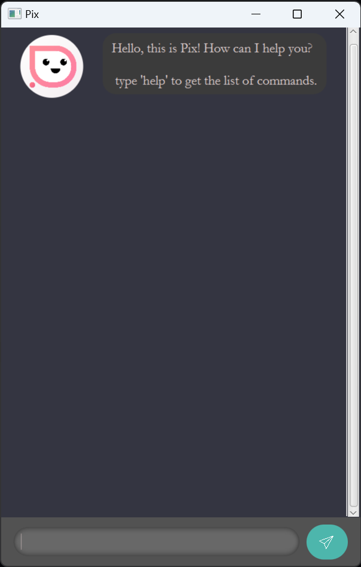

# Pix User Guide
> The best task manger you have ever used! - Pix

**Pix helps to remember stuff for you so that you do not have to! It is a Command-Line based task manager that is ~~easy~~ super easy to learn and quick to use.**

- [Installation](#installation)
- [Features](#features)
- [Commands](#commands)
- [Summary](#command-summary)

## Installation
___
1. Ensure that you have java `11` installed.
2. Download the [ip.jar](https://github.com/zenithyap/ip/releases/download/Level-9/ip.jar) file.
3. Open a terminal and navigate to the folder the file is downloaded in.
4. Run the command `java -jar ip.jar`
5. You should see the following:

## Features
___
### Manages Your Tasks
- Able to add/delete tasks
- Supports 3 tasks, todo, deadlines, and events
- Mark/Unmark tasks
- Find tasks by keyword

## Commands
___
### `help`
Shows all the commands.

Format: `help`

### `todo`
Adds a todo task.

Format: `todo <Description>`

### `dline`
Adds a deadline task. dueDate to be specified as yyyy-MM-dd HH:mm.

Format: `dline <Description> / <dueDate>`

### `event`
Adds an Event task. eventStart and eventEnd to be specified as yyyy-MM-dd HH:mm.

Format: `event <Description> / <eventStart> / <eventEnd>`

### `ls`
Lists all the tasks.

Format: `ls`

### `lsd`
Lists deadlines that are due by the date and events that area ongoing during the date. Date format as yyyy-MM-dd

Format: `lsd <Date>`

### `mk`
Marks a task as done.

Format: `mk <Index>`

### `unmk`
Unmarks a task.

Format: `unmk <Index>`

### `rm`
Removes a task from the list.

Format: `rm <Index>`

### `find`
Find tasks that contains a keyword.

Format: `find <Keyword>`

### `bye`
Exits pix.

Format: `bye`

## Command Summary
___

| Command | Format                                            |
|---------|---------------------------------------------------|
| Help    | `help`                                            |
| Todo    | `todo <Description>`                              |
| dline   | `dline <Description> / <dueDate>`                 |
| event   | `event <Description> / <eventStart> / <eventEnd>` |
| ls      | `lsd`                                             |
| lsd     | `lsd <Date>`                                      |
| mk      | `mk <Index>`                                      |
| unmk    | `unmk <Index>`                                    |
| rm      | `rm <Index>`                                      |
| find    | `find <Keyword>`                                  |
| bye     | `bye`                                             |
