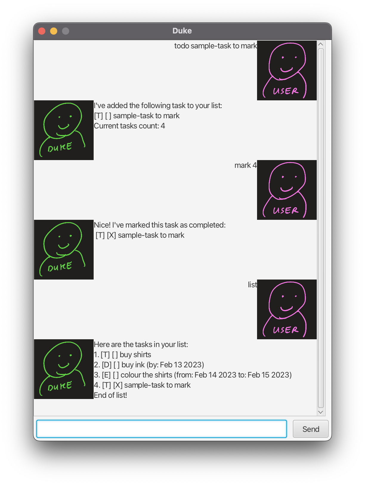
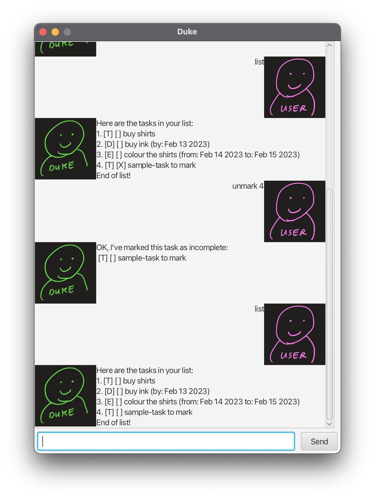
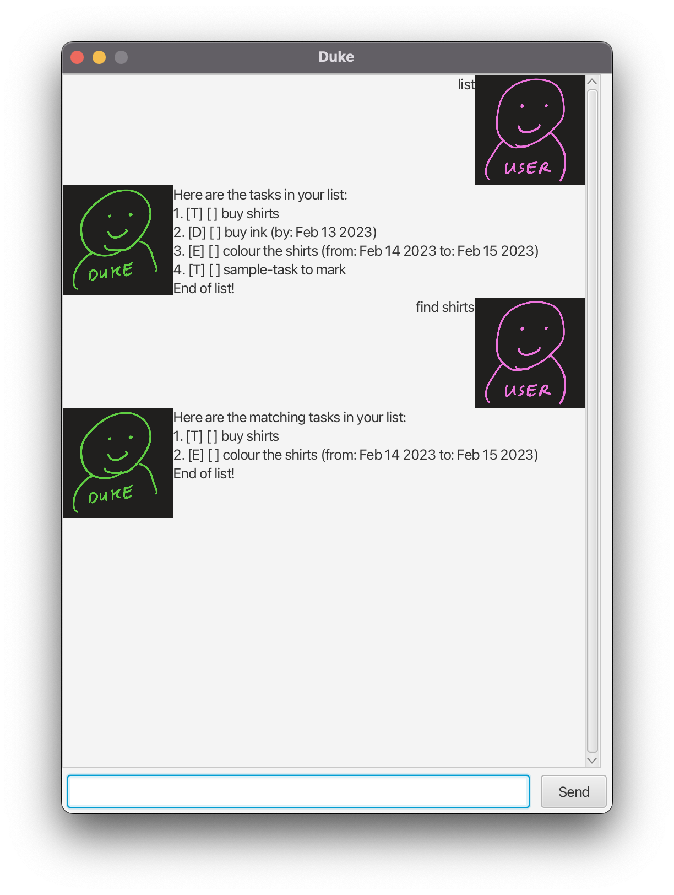

# User Guide

## Feature summary
1. Add
2. Delete
3. Mark 
4. Unmark 
5. Find 
6. List

## Usage: 

### Add task
Add to Duke any tasks that you wish to track

**Command formats:**

* `todo {task name}` - add todo task

* `deadline {task name} /by{end date}` - add deadline task

* `event {task name} /from{start date} /to{end date}` - add event task

**Expected outcomes:**

```
I've added the following task to your list:
[T] [ ] {task name}
Current tasks count: {#tasks}

I've added the following task to your list:
[D] [ ] {task name} (by: {end date})
Current tasks count: {#tasks}

I've added the following task to your list:
[E] [ ] {task name} (from: {start date} to: {end date})
Current tasks count: {#tasks}
```

<br>

### Delete task
Delete from Duke any tasks that you no longer wish to track

**Command format:**

* `delete {task index}` - delete task at task index

**Expected outcome:**

```
I've removed the following task from your list:
[T] [ ] {task name}
Current tasks count: {#tasks}
```

<br>

### Mark task as complete
Once a task is marked as complete, it will be shown with a ['X']

**Command format:**

* `mark {task index}` - mark task at task index as completed

**Expected outcome:**

```
Nice! I've marked this task as completed:
 [T] [X] {task name}
```

<br>

### Mark task as incomplete
Once a task is marked as incomplete, it will be shown with a [' ']

**Command format:**

* `unmark {task index}` - mark task at task index as incomplete

**Expected outcome:**

```
OK, I've marked this task as incomplete:
 [T] [ ] {task name}
```

<br>

### Find task
Find any task(s) by simply searching for their name 

**Command format:**

* `find {keyword}` - returns all tasks with the keyword in their name

**Expected outcome:**

```
Here are the matching tasks in your list:
1. [D] [ ] {task name} (by: {end date})
2. [E] [ ] {task name} (from: {start date} to: {end date})
End of list!
```

<br>

### List task
View all your tasks and their completion statuses at once

**Command format:**

* `list` - returns all tasks in a list view

**Expected outcome:**

```
Here are the tasks in your list:
1. [D] [ ] {task name} (by: {end date})
2. [E] [ ] {task name} (from: {start date} to: {end date})
End of list!
```
<div align="center">refer to screenshot above</div>
<br>
<br>

## Command alternatives:
```
todo - t
deadline - d
event - e
delete - d
mark - m
unmark - um
find - f
list - l
```
