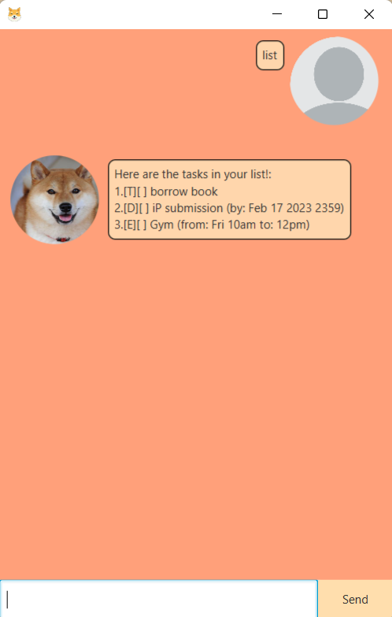
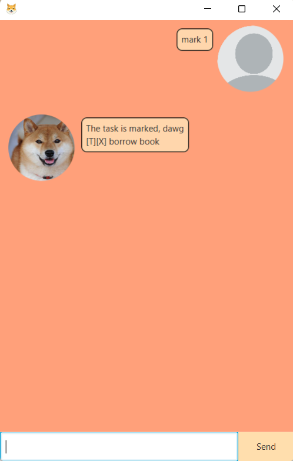
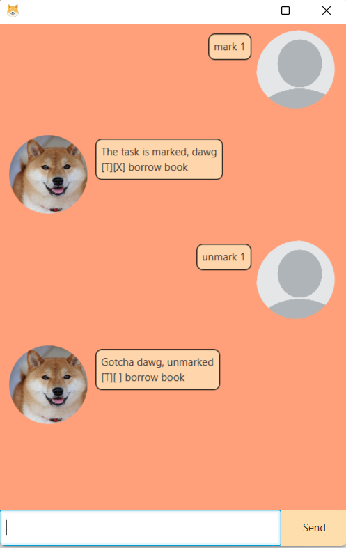
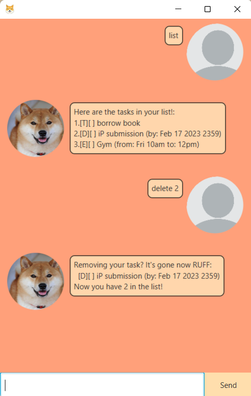
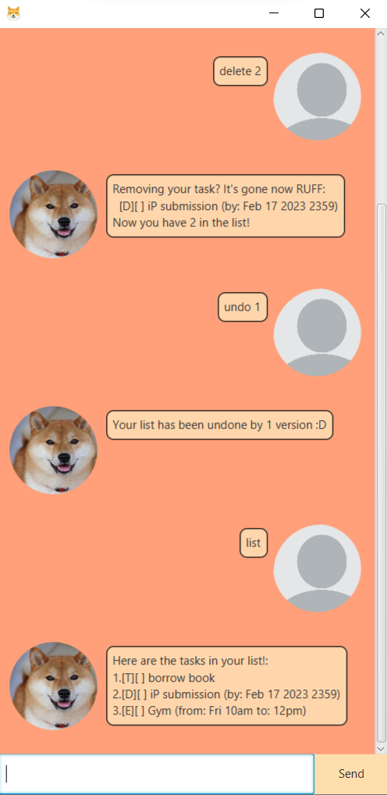

# User Guide
- Quickstart
- Features
  - View
    - [Viewing your tasks: `list`](#list)
  - Create
    - [Creating a to-do task: `todo`](#todo)
    - [Creating a deadline task: `deadline`](#deadline)
    - [Creating an event task: `event`](#event)
  - Mark/Unmark
    - [Marking a task: `mark`](#mark)
    - [Unmarking a task: `unmark`](#unmark)
  - Delete
    - [Deleting a task: `delete`](#delete)
  - Find
    - [Finding tasks: `find`](#find)
  - Undo
    - [Undoing a create, mark, unmark and delete command: `undo`](#undo)
  - Bye
    - [Exiting the program: `Bye`](#bye)
- [Summary](#summary)
  
  
## Features

## List
Command format: `list`

Displays a list of task you have created. You can also view the task number accordingly for other commands.

[Back to top](#top)
## Todo
Command format: `todo [NAME]`

Creates a to-do task to the list by stating the name of the task.

Example: `todo borrow book: Harry Potter and the Goblet of Fire`

[Back to top](#top)
## Deadline
Command format: `deadline [NAME] /by [DATE] [TIME]`

Creates a daedline task, by stating the name, followed by a data and time after `/by`. The date should be formatted in DD/MM/YYYY format.

Example: `deadline Finish CSXXXX Assignment /by 24/03/2023 2359`

[Back to top](#top)
## Event
Command format: `event [NAME] /from [DATE/TIME] /to [DATE/TIME]`

Creates an event task, stating a name, a date or time after /from, and another instance after /to.

Example: `event Go for Standard Chartered 42.195km run /from Mon 2pm /to 5pm

[Back to top](#top)
## Mark
Command format: `mark [NUMBER]`

Ticks a task to mark it done, by stating the task number.

Example: `mark 1`

[Back to top](#top)
## Unmark
Command format: `unmark [NUMBER]`

Unticks a task to mark it undone, by stating the task number.

Example: `unmark 1`

[Back to top](#top)
## Delete
Command format: `delete [NUMBER]`

Deletes a task in the list, by stating the task number.

Example: `delete 1`

[Back to top](#top)
## Find
Command format: `find [KEYWORD]`

Find a task/tasks containing a keyword given.

Example: `find book`

[Back to top](#top)
## Undo
Command format: `undo [NUMBER]`

Undoes the previous commands by a given number of version.
Only commands that are under Create, Mark/Unmark and Delete can be undone.

Example: `undo 2`

[Back to top](#top)
## Bye
Command format: `bye`

Say goodbye to Lele and exit the program.

[Back to top](#top)
## Summary
|Command|Format|
|-------|------|
|list|`list`|
|todo|`todo [NAME]`|
|deadline|`deadline [NAME] /by [DD/MM/YYYY] [TIME]`|
|event|`event [NAME] /from [DATE/TIME] /to [DATE/TIME]`|
|mark|`mark [NUMBER]`
|unmark|`unmark [NUMBER]`|
|delete|`delete [NUMBER]`|
|find|`find [KEYWORD]`|
|undo|`undo [NUMBER]`
|bye|`bye`|

[Back to top](#top)
