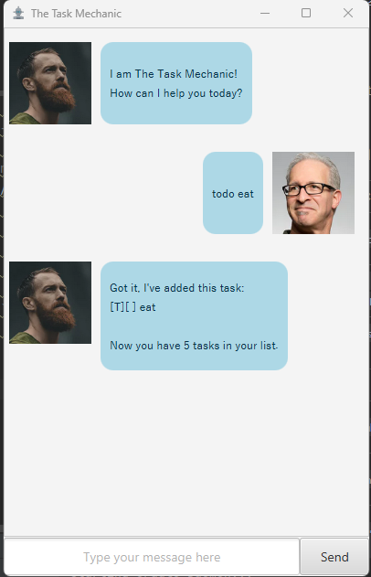
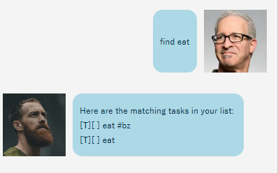
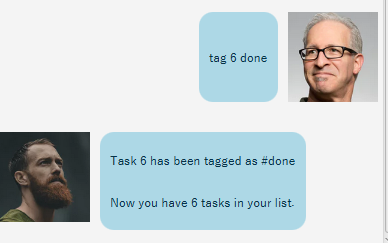
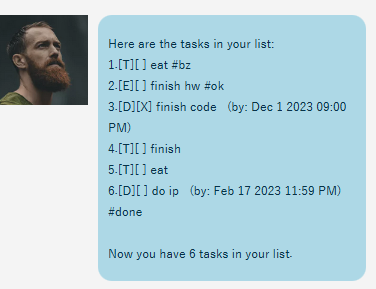

# User Guide

## Introduction
The Task Mechanic is here to help you with managing all your tasks!

## Contents
1. [Features](#features)
2. [Usage](#usage)
3. [Commands](#commands)
4. [Command Summary](#command-summary)

## Features 

### Add Tasks

1. Todo Task
2. Event Task
3. Deadline Task

### Delete Tasks

Allows deletion of tasks from your storage

### Mark and UnMarking Tasks

Completed your tasks? 
Use the mark feature to indicate done!

### Tag your tasks
Diffcult tasks? Tag them! 

## Usage

### Quick Start

1. Ensure that you have Java 11 installed.
2. Download the jar file of this application [here](https://github.com/RyanQiu1/ip/releases).
3. Copy the file to the folder you want to use as your home folder for The Task Mechanic.
4. Navigate to that folder through CLI.
5. Run `java -jar (name of the jar file).jar` in terminal.
6. The GUI in [UI](https://github.com/RyanQiu1/ip/blob/master/docs/Ui.png) should appear! Use Away!

## Commands

`todo {description}` 
- Fill in the description of the task with the keyword todo.

`deadline {description} /by YYYY-MM-DD HH:MM` 
- Fill in the description, date and time in the following format for the deadline task.

`event {description} /from {anything} /to {anything}`
- Fill in the description in the following format for event task.

`delete {task number}`
- Fill in the task number with the following format for deleting task.

`mark {task number}`
- Fill in the task number with the following format for marking task.

`unmark {task number}`
- Fill in the task number with the following format for unmarking task.

`find {description matching text}`
- Fill in the description that you want to find in the task list.

`tag {task number} {description}`
- Fill in the task number and description with the following format for tagging tasks.

`list`
- Shows all the tasks you currently have.

`bye`
- To end the program.

## Command Summary

|                     Command                     |                              Description                               |
|:-----------------------------------------------:|:----------------------------------------------------------------------:|
|               todo `description`                |              Creates a todo with the given `description`               |
| deadline `description` /by `YYYY-MM-DD` `HH:MM` | Creates a deadline with the given `description` set by the given time. |
|   event `description` /from `when` /to `when`   |  Creates an event with the given `description` set at the given time.  |
|                      list                       |                    Lists all currently saved tasks.                    |
|                  mark `number`                  |               Marks task `number` from list as complete.               |
|                 unmark `number`                 |              Marks task `number` from list as incomplete.              |
|                 delete `number`                 |              Deletes task `number` from list permanently.              |
|               find `description`                |      Returns all tasks whose `description` match the exact text.       |
|              tag `number` `phrase`              |                   Tag task `number` with a `phrase`.                   |
|                       bye                       |              Saves all tasks to storage and ends program.              |

