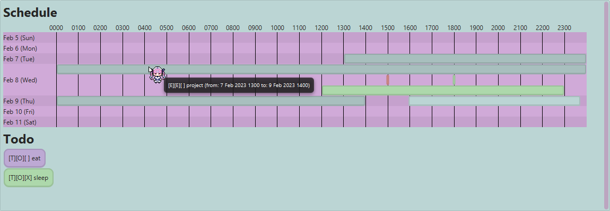

# User Guide

## Features

### Task management

Aqua remembers and manages your day to day tasks so that you can plan your time with ease.

### View weekly schedule

Aqua will draw out your weekly schedule so that you know when you can roll in be more.

## Syntax

Command inputs will have the following syntax.

```text
{command} [/MAIN_INPUT]{parameter} /{parameter name} {parameter} ...
```

- `command` is a single word
- `parameter` may contain spaces
- Whitespaces between `/` and `parameter name` is allowed

### Types

Command parameters will be presented in the following format:

`<type:name>`

- `type` - the type of the parameter
- `name` - name of the parameter

#### `boolean`

Booleans can only take the value `true` or `false`.

#### `date`

The supported date formats are:

- `yyyy-mm-ddThh:mm`
- `yyyy-m-d hhmm` - single and double digit day and months are supported.
- `yyyy-m-d` - time is assumed to be 0000.

#### `integer`

An integer value.

#### `string`

Strings can take any character sequence that does not contain `/`.

## Usage

### `todo` - Adds a todo

Syntax:

```text
todo <string:taskName> [/completed <boolean:isCompleted>]
```

Outcome:

A todo will be added and saved.

### `deadline` - Adds a deadline

Syntax:

```text
deadline <string:taskName> /by <date:dueDate> [/completed <boolean:isCompleted>]
```

Outcome:

A deadline will be added and saved.

### `event` - Adds an event

Syntax:

```text
event <string:taskName> /from <date:startDate> /to <date:endDate> [/completed <boolean:isCompleted>]
```

Outcome:

An event will be added and saved.

### `delete` - Deletes a task

Syntax:

```text
delete <integer:taskNumber>
```

Outcome:

Task tied to the specified task number will be deleted.

### `mark` - Marks a task as complete

Syntax:

```text
mark <integer:taskNumber>
```

Outcome:

Task tied to the specified task number will be marked completed.

### `unmark` - Marks a task as incomplete

Syntax:

```text
unmark <integer:taskNumber>
```

Outcome:

Task tied to the specified task number will be marked incompleted.

### `list` - Lists all tasks

Syntax:

```text
list
```

Outcome:

A numbered list of tasks. The number corresponds to the task number that task is tied to.

### `find` - Finds tasks by keyword

Syntax:

```text
find <string:taskNameKeyword>
```

Outcome:

A numbered list of tasks. The number corresponds to the task number that task is tied to.

### `view` - Displays your schedule

Syntax:

```text
view [<date:dayOfWeekToShow>]
```

Outcome:

A popup showing your schedule.

-- _Cursor not included_ --
