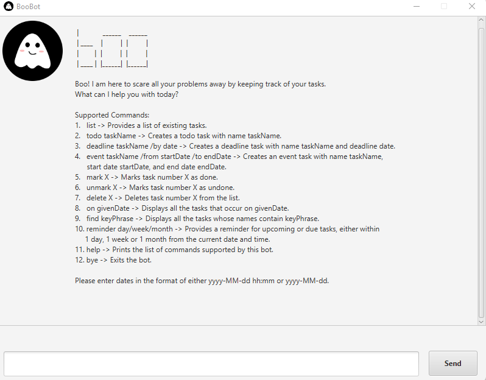

# User Guide for BooBot
BooBot is a **desktop application** that helps you to keep track of your tasks, saving time and
ensuring that you are on track. Problems would be scared away with good task management provided by
BooBot. While there is a Graphical User Interface (GUI), users would mostly interact with BooBot
via text-commands.

- [Quick Start](#quick-start)
- [Features](#features)

  - [List All Tasks: `list`](#list---list-all-tasks)
  - [Create ToDo Task: `todo`](#todo---create-todo-task)
  - [Create Deadline Task: `deadline`](#deadline---create-deadline-task)
  - [Create Event Task: `event`](#event---create-event-task)
  - [Mark Task as Done: `mark`](#mark---mark-task)
  - [Mark Task as Undone: `unmark`](#mark---unmark-task)
  - [Delete Task: `delete`](#delete---delete-task)
  - [List Tasks on a Specific Day: `on`](#on---get-tasks-on-a-specific-day)
  - [Find Tasks: `find`](#find---find-tasks)
  - [Get Reminder for Tasks: `reminder`](#reminder---get-reminder-for-tasks)
  - [Help: `help`](#help---get-help)
  - [Exit: `bye`](#bye---exit)
  - [Saving and Loading of Data](#saving-and-loading-of-data)
  
- [Command Summary](#command-summary)
- [Acknowledgements](#acknowledgements)


## Quick Start
1. Ensure that you have installed **Java 11** on your computer.
   If not, you can download it [here](https://www.oracle.com/java/technologies/downloads/#java11).
2. Download the latest release for BooBot [here](https://github.com/eugenetangkj/ip).
3. Open a command line interface, and change directory into the location where the release is stored.
4. Run `java -jar boobot.jar`.
5. BooBot would launch, where you should see something like this:



## Features

### `list` - List All Tasks

Displays a list of all existing tasks.

Format: `list`
<br/>
<br/>

### `todo` - Create ToDo Task

Adds a new todo task to the list of existing tasks.

Format: `todo TASK_NAME`

Remarks:
- `TASK_NAME` is compulsory.

Examples:
- `todo read book` Adds a new todo task with name _read book_ to the list of existing tasks.
- `todo` Displays an error message because the task name is missing.
<br/>
<br/>

### `deadline` - Create Deadline Task

Adds a new deadline task to the list of existing tasks.

Format: `deadline TASK_NAME /by DEADLINE`

Remarks:
- `TASK_NAME` and `DEADLINE` are compulsory.
- `DEADLINE` has to be in the format of either `yyyy-MM-dd hh:mm` or `yyyy-MM-dd`.

Examples:
- `deadline return book /by 2023-02-03 14:00` Adds a new deadline task with name _return book_ and deadline
  _2023-02-03 14:00_ to the list of existing tasks.
- `deadline return book /by 2023-02-03` Adds a new deadline task with name _return book_ and deadline
  _2023-02-03_ to the list of existing tasks.
- `deadline return book /by 3rd February 2023` Displays an error message because the date is of incorrect
  format.
- `deadline return book` Displays an error message because the deadline is missing.
<br/>
<br/>

### `event` - Create Event Task

Adds a new event task to the list of existing tasks.

Format: `event TASK_NAME /from START_DATE /to END_DATE`

Remarks:
- `TASK_NAME`, `START_DATE` and `END_DATE` are compulsory.
- `START_DATE` and `END_DATE` have to be in the format of either `yyyy-MM-dd hh:mm` or `yyyy-MM-dd`.
- `START_DATE` must be before or equal to `END_DATE`.

Examples:
- `event project meeting /from 2023-02-03 14:00 /to 2023-02-03 18:00` Adds a new event task with name
  _project meeting_ and duration from _2023-02-03 14:00_ to _2023-02-03 18:00_.
- `event project meeting /from 2023-02-03 /to 2023-02-03` Adds a new event task with name
  _project meeting_ and duration from _2023-02-03_ to _2023-02-03_.
- `event project meeting /from 2023-02-03 /to 2023-02-01` Displays an error message because the start
  date is after the end date.
- `event project meeting /from 2023-02-03` Displays an error message because the end date is missing.
<br/>
<br/>

### `mark` - Mark Task

Marks the status of a task as done.

Format: `mark TASK_NUMBER`

Remarks:

- `TASK_NUMBER` is compulsory.
- `TASK_NUMBER` must be a valid task number as shown in `list`.

Examples:

- `mark 2` Marks the status of task number 2 as done (assuming you have 2 or more tasks in your list).
-  `mark 0` Displays an error message because task numbers start from 1.
<br/>
<br/>

### `unmark` - Unmark Task

Marks the status of a task as undone.

Format: `unmark TASK_NUMBER`

Remarks:
- `TASK_NUMBER` is compulsory.
- `TASK_NUMBER` entered must be a valid task number as shown in `list`.

Examples:

- `unmark 2` Marks the status of task number 2 as undone (assuming you have 2 or more tasks in your list).
-  `mark 0` Displays an error message because task numbers start from 1.
<br/>
<br/>

### `delete` - Delete Task

Deletes a task in the list of existing tasks.

Format: `delete TASK_NUMBER`

Remarks:
- `TASK_NUMBER` is compulsory.
- `TASK_NUMBER` entered must be a valid task number as shown in `list`.

Examples:

- `delete 2` Deletes task number 2 from the list of existing tasks (assuming you have 2 or more tasks in your list).
-  `delete 0` Displays an error message because task numbers start from 1.
<br/>
<br/>

### `on` - Get Tasks on a Specific Day

Displays a list of tasks that fall on a given day.

Format: `on DAY`

Remarks:

- `DAY` is compulsory.
- `DAY` has to be in the format of either `yyyy-MM-dd hh:mm` or `yyyy-MM-dd`.

Examples:

- `on 2023-02-03` Displays all tasks that fall on _2023-02-03_.
-  `on 3rd February 2023` Displays an error message because the date is of incorrect format.
<br/>
<br/>

### `find` - Find Tasks

Displays a list of tasks whose names contain a given key phrase/word.

Format: `find PHRASE`

Remarks:

- `PHRASE` is compulsory.
- `PHRASE` can either be a word or a phrase.

Examples:

- `find book` Displays all tasks whose names contain _"book"_.
- `find return book` Displays all tasks whose names contain _"return book"_.
-  `find` Displays an error message because there is a missing search term.
<br/>
<br/>

### `reminder` - Get Reminder for Tasks 

Displays a list of due and upcoming tasks, either within 1 day, 1 week or 1 month from the current time.

Format: `reminder DURATION`

Remarks:

- `DURATION` is compulsory.
- `DURATION` can only be `day`, `week`, or `month`.

Examples:

- `reminder day` Displays all deadline tasks that are due a day later, and all event tasks that are
  either upcoming in one day or whose duration span over the next day.
- `reminder week` Displays all deadline tasks that are due within a week, and all event tasks that are
  either upcoming within the week or whose duration span over the week.
- `reminder month` Displays all deadline tasks that are due within the month, and all event tasks that are
  either upcoming within the month or whose duration span over the month.
- `reminder` Displays an error message because there is a missing duration.
<br/>
<br/>

### `help` - Get Help

Displays the list of commands supported by BooBot.

Format: `help`

Expected output:
```
Supported Commands:
1.  list -> Provides a list of existing tasks.
2.  todo taskName -> Creates a todo task with name taskName.
3.  deadline taskName /by date -> Creates a deadline task with name taskName and deadline.
4.  event taskName /from startDate /to endDate -> Creates an event task with name taskName,
    start date startDate, and end date endDate.
5.  mark X -> Marks task number X as done.
6.  unmark X -> Marks task number X as undone.
7.  delete X -> Deletes task number X from the list.
8.  on givenDate -> Displays all the tasks that occur on givenDate.
9.  find keyPhrase -> Displays all the tasks whose names contain keyPhrase.
10. reminder day/week/month -> Provides a reminder for upcoming or due tasks, either within
    1 day, 1 week or 1 month from the current date and time.
11. help -> Prints the list of commands supported by this bot.
12. bye -> Exits the bot.

Please enter dates in the format of either yyyy-MM-dd hh:mm or yyyy-MM-dd.
```
<br/>
<br/>

### `bye` - Exit

Exits BooBot where the application automatically closes after 5 seconds.

Format: `bye`

Expected output:
```
Goodbye. Hope that I have managed to scare all your problems away. Have a great day! :)
```
<br/>
<br/>

### Saving and Loading of Data
Your task list would be saved automatically whenever a change to the list is made in the
application. The data for the task list is stored locally on your computer, in a file called
`data.txt` which is found in the same directory as the BootBot release.

You are free to look into the file and modify the data as needed, but avoid tampering with the
format. If the format is altered, BooBot will not be able to read the data and this would risk
your original data being overwritten by BooBot.
<br/>
<br/>

## Command Summary
| Command                                          | Description                                                 |
|--------------------------------------------------|-------------------------------------------------------------|
| `list`                                           | Lists all existing tasks                                    |
| `todo TASK_NAME`                                 | Creates a new todo task                                     |
| `deadline TASK_NAME /by DEADLINE`                | Creates a new deadline task                                 |
| `event TASK_NAME /from START_DATE /to END_DATE ` | Creates a new event task                                    |      
| `mark TASK_NUMBER`                               | Marks a task as done                                        |
| `unmark TASK_NUMBER`                             | Marks a task as undone                                      |
| `delete TASK_NUMBER`                             | Deletes a task                                              |
| `on DAY`                                         | Lists all existing tasks that fall on a given day           |
| `find PHRASE `                                   | Lists all existing tasks whose names contain a given phrase |
| `reminder DURATION`                              | Lists all existing tasks that are either due or upcoming    |
| `help`                                           | Lists all available commands supported by BooBot            |
| `bye`                                            | Exits BooBot                                                |
<br/>

## Acknowledgements
BooBot is created using Java 11, and the libraries used are [JavaFX](https://openjfx.io/) and
[JUnit](https://github.com/junit-team/junit5).
