# User Guide

## Features 

### Feature-Create, List, Delete and Mark Task

User can create tasks of `todo, deadline, event`. All tasks added can be viewed a list. Task can be deleted too 
and can be either __mark__ as *complete* or __unmark__ as *incomplete*.

### Feature-Find

User can filter and find task based on a __keyword__.

### Feature-Notes
User can add notes under each task. All task with notes can be filtered and view separately from task that does 
not consist of a note. The notes under the task can also be deleted too.

### Feature-Help
User can look up the purpose of every command and the examples of how to use them through `help`.

### Feature-Load and Save Tasks
Tasks enter by the user can be saved too once user enters `bye`. When the application is booted up again, the 
saved data will be loaded and user will be able to view them.

## Usage
Please note that the commands are __case-sensitive__!

### `todo` - Add a todo task
A todo task will be created and added into the list of tasks.
- Syntax: `todo <name of Task>`

Example of usage: 
```
todo Buy textbook
```
Expected outcome:

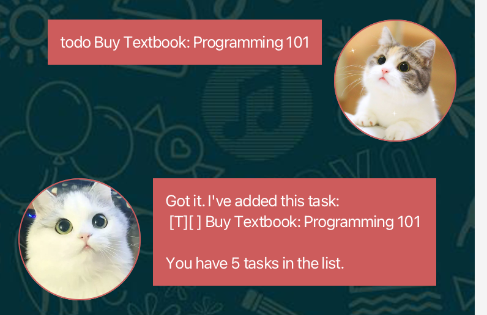

### `deadline` - Add a deadline task
A deadline task will be created and added into the list of tasks. Deadline task must consist of a deadline to 
indicate when the task should be completed by.
- Syntax: `deadline <name of Task> /by <dd/MM/yyyy HH:mm>`
- `dd/MM/yyyy mm:HH` stands for Date/Month/Year Hour:Minutes

Example of usage:
```
deadline Complete CS2103T quiz week 6 /by 17/02/2023 14:00
```
Expected outcome:

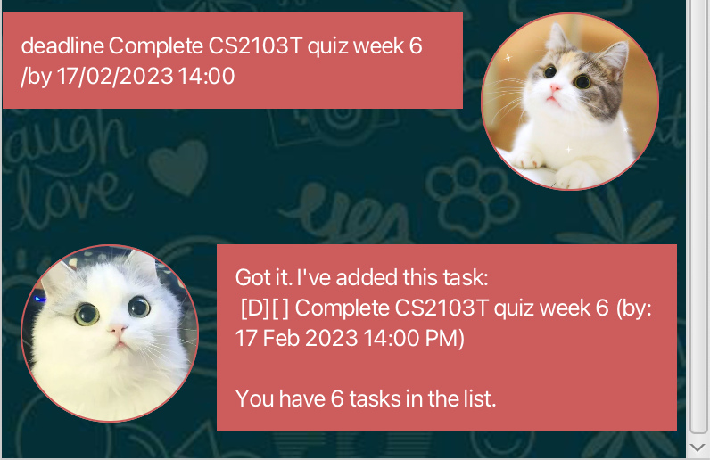

### `event` - Add a event task
An event task will be created and added into the list of tasks. Event task must consist of a start date 
and an end date.
- Syntax: `event <name of Task> /from <dd/MM/yyyy HH:mm> /to dd/MM/yyyy HH:mm>`
- `dd/MM/yyyy mm:HH` stands for Date/Month/Year Hour:Minutes

Example of usage:
```
event CCA Camping /from 20/3/2023 10:00 /to 23/3/2023 12:00
```
Expected outcome:

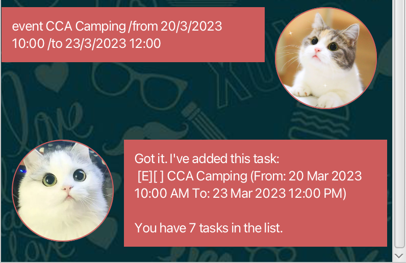

### `list` - View all task
All task entered will be displayed.
- Syntax: `list`

Example of usage:
```
list
```
Expected outcome:

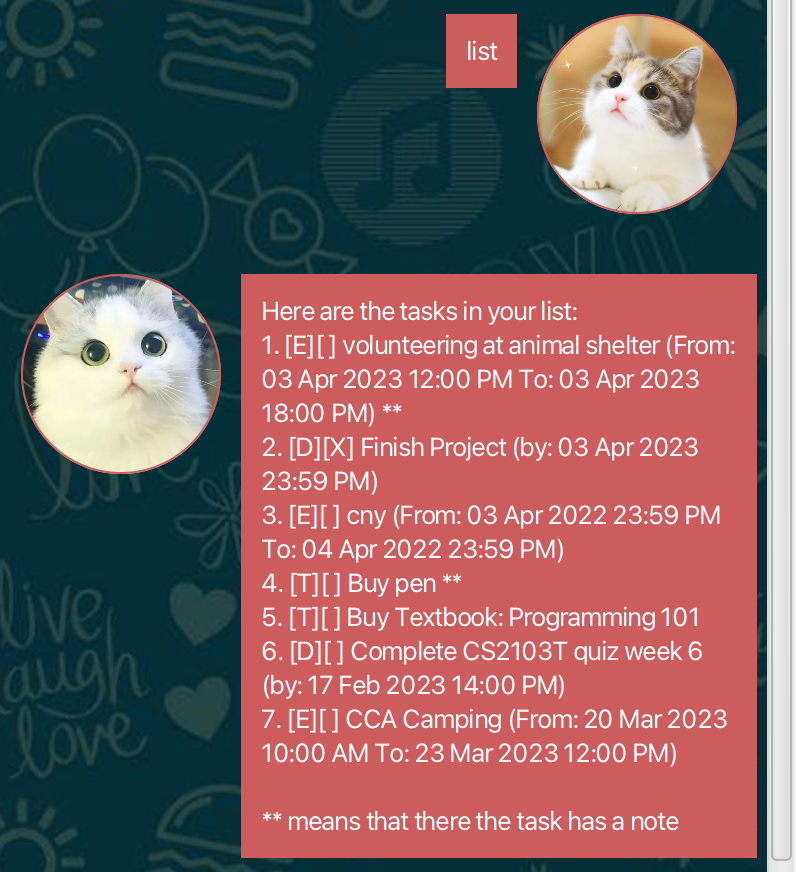

### `delete` - delete a task
Task with the given index will be deleted.
- Syntax: `delete <index>`

Example of usage:
```
delete 2
```
Expected outcome:

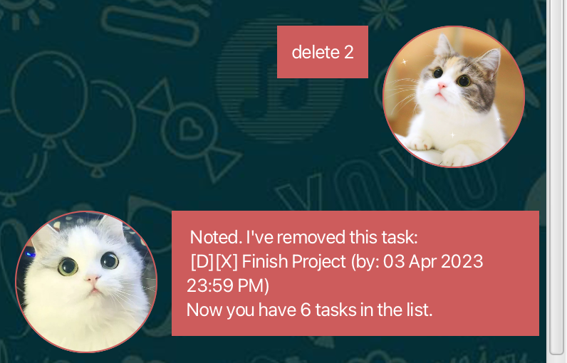

### `mark` - mark a task
Task with the given index will be mark as complete.
- Syntax: `mark <index>`

Example of usage:
```
mark 3
```
Expected outcome:


### `unmark` - unmark a task
Task with the given index will be mark as complete.
- Syntax: `unmark <index>`

Example of usage:
```
unmark 3
```
Expected outcome:

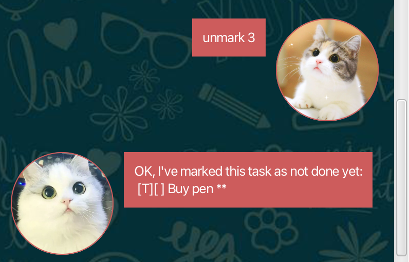

### `find` - Find task(s)
Find task(s) with the given keyword
- Syntax: `find <keyword>`

Example of usage:
```
find Buy
```
Expected outcome:

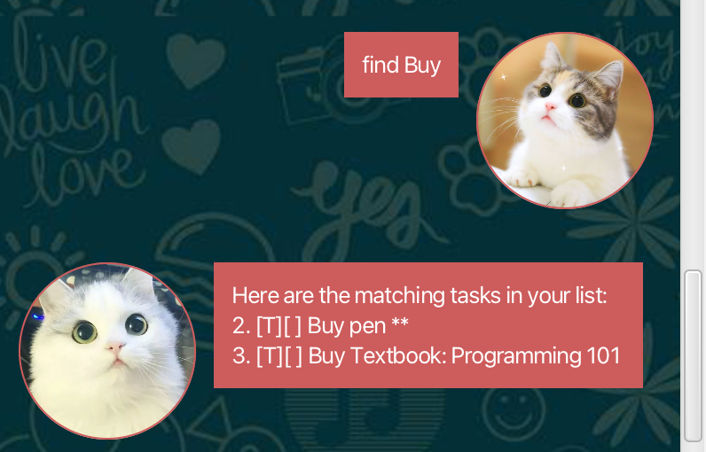

### `addNote` - Add a note
A note will be added to the task with the given index.
- Syntax: `addNote <index> <message>`

Example of usage:
```
addNote 5: Clarify doubts on question 5 and 10.
```
Expected outcome:

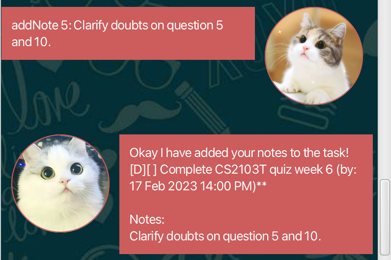

### `listNote` - View task with note
A note will be added to the task with the given index.
- Syntax 1: `listNote` - Views all tasks with notes
- Syntax 2: `listNote <index>` - View only __ONE__ task (with notes) given the index 

Example of usage (syntax 1):
```
listNote
```
Expected outcome:

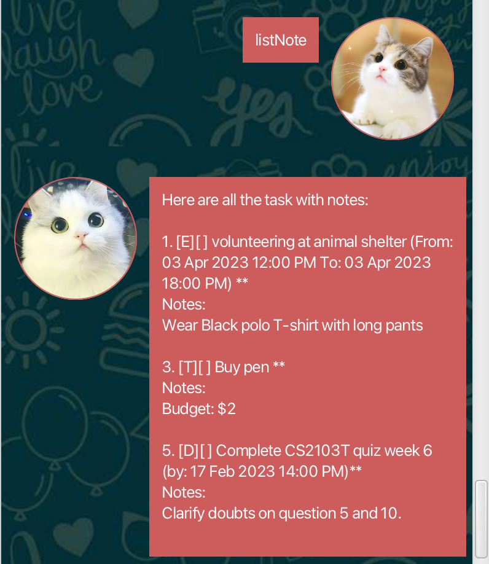

Example of usage (syntax 2):
```
listNote 5
```
Expected outcome:

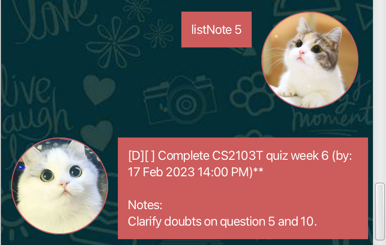

### `deleteNote` - Delete a note
The note in the given index of the task will be deleted.
- Syntax: `deleteNote <index>`

Example of usage:
```
deleteNote 3
```
Expected outcome:

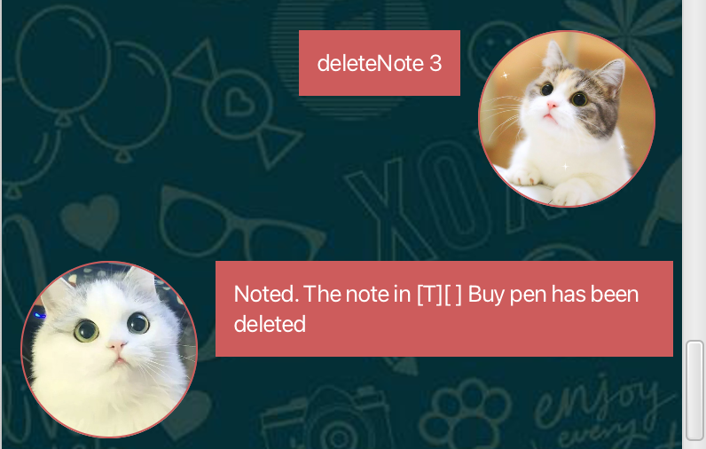

### `help` - View all commands
Purpose and example of the command will be listed.
- Syntax: `help`

Example of usage:
```
help
```
Expected outcome:

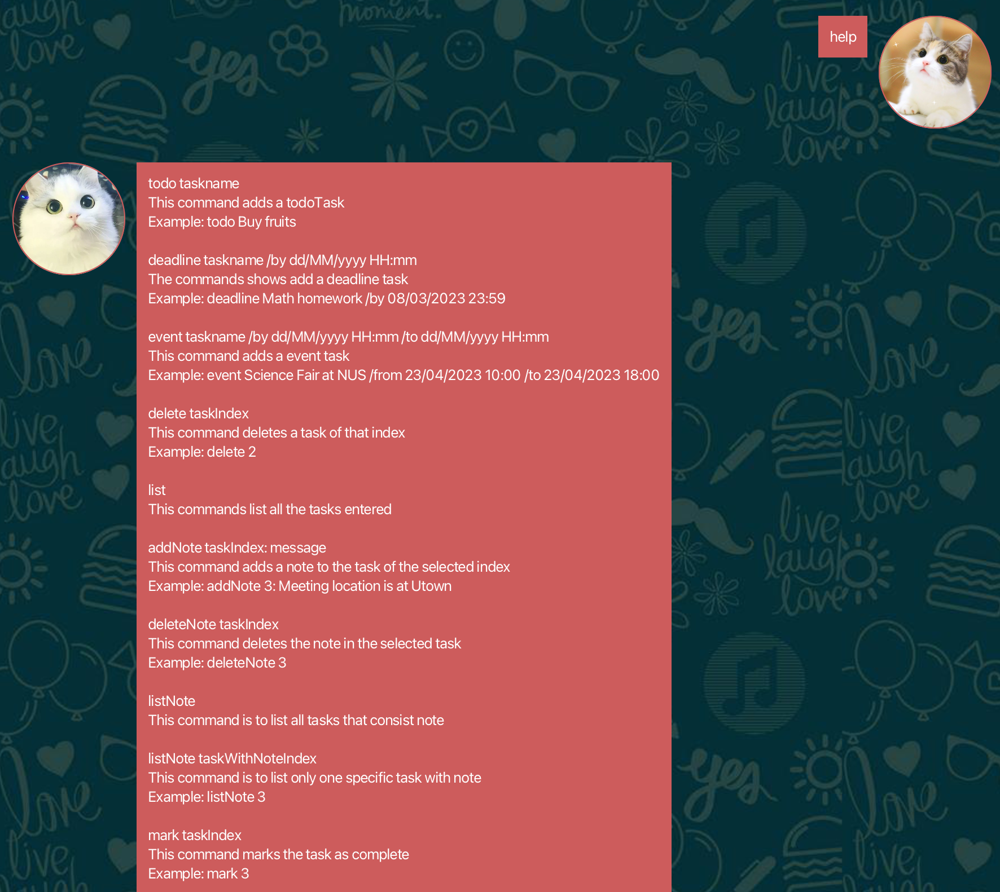

### `bye` - Exit program and save task
Program will save all the task into the file before exiting the application.

__Note that this is the only way to save the file!__

- Syntax: `bye`

Example of usage:
```
bye
```


