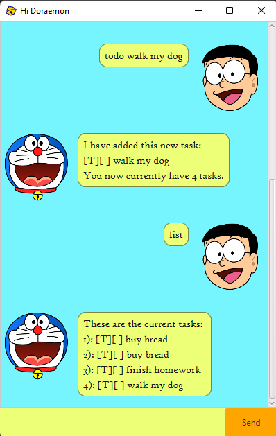

# ChadBot 
Chadbot application is designed for user to **manage their day-to-day tasks**. It
is optimized for use via Command Line Interface (CLI) and Graphical User Interface (GUI).

<br/>

<div align="center">
 
</div>
 
<br/>
 
 ## Content
- [Quick Start](#quick-start)
- [Features](#features)
  * [Add a Todo Task](#add-a-todo-task)
  * [Add a Deadline](#add-a-deadline)
  * [Add an Event](#add-an-event)
  * [Find Task by Keyword](#find-task-by-keyword)
  * [View Task List](#view-task-list)
  * [Mark Task as Done](#mark-task-as-done)
  * [Mark Task as Undone](#mark-task-as-undone)
  * [Delete a Task](#delete-a-task)
  * [Exiting the Program](#exiting-the-program)
- [Command Summary](#command-summary)

## Quick Start
> **Prerequisites**
> + JDK11
> + Intellij Idea 

1. Ensure you have `Java 11` or above installed in your Computer.
2. Download the latest `chad.jar` from [here](https://github.com/Jnjy/ip/releases/tag/v0.2).
3. Copy the file to the folder you want to use as the home folder for your ChadBot.
4. Open a command terminal, cd into the folder you put the `jar` file in, and use the `java -jar chad.jar` command to run the application.
5. Proceed to explore more on what ChadBot has to offer.


## Features 

### Add A Todo Task

Adds a Todo task into the current task list and response upon successful insertion.

**Parameter(s):**
- Description - Short description of the todo task you wish to add into your task list.

**Command Format:** `todo <description>`

**Example of usage:**
```markdown
todo CS2103T Week 6 Task
```

**Expected outcome:**
*Returns response with the description of your todo task.*
```markdown
Great! I've added this task for you
 [T][ ] CS2103T Week 6 Task 
You have 1 tasks in the list.
```
### Add a Deadline

Adds a deadline task into the current task list.

**Parameter(s)**:
- Description - Short description of the deadline you wish to add into your task list.
- Due Date - The date 

**Command Format:** `deadline <Description> /by <Due Date>`

**Example of usage:**
```markdown
deadline CS2103T UG Submission /by 2023-02-17 2359
```

**Expected outcome:**
*Returns response with the description of your deadline.*
```markdown
Great! I've added this task for you
 [D][ ] CS2103T UG Submission (by: Feb 17 2023, 11:59PM) 
You have 1 tasks in the list.
```

### Add an Event

Adds an event task into the current task list.

**Parameter(s):**
- Description - Short description of the event you wish to add into your task list.
- Start Date - Date when the event starts
- End Date - Date when the event ends

**Command Format:** `event <Description> /from <Start Date> /to <End Date>`

**Example of usage:**
```markdown
event TP Project /from 2023-02-14 2359 /to 2023-04-14 2359
```

**Expected outcome:**
*Returns response with the description of your event.*
```markdown
Great! I've added this task for you
 [E][ ] TP Project (from: Feb 14 2023, 11:59PM to: Apr 14 2023, 11:59PM) 
You have 13 tasks in the list.
```
### Find Task by Keyword

Find task with specified keyword in the current task list.

**Parameter(s):**
- Keyword - The keyword you wish to use to find the specific task in the task list.

**Command Format:** `find <Keyword>`

**Example of usage:**
```
find CS2103T
```
**Expected outcome:**
*Returns the found task with your specified keyword.*
```markdown
[D][ ] CS2103T UG Submission (by: Feb 17 2023, 11:59PM)
```

### View Task List

View the current task list.

**Command Format:** `list`

**Expected outcome:**
*Returns all item in the task list.*
```markdown
1: [T][ ] CS2103T Week 6 Task
2: [D][ ] CS2103T UG Submission (by: Feb 17 2023, 11:59PM)
3: [E][ ] TP Project (from: Feb 14 2023, 11:59PM to: Apr 14 2023, 11:59PM)
```
### Mark Task as Done

Mark task of specified index in the current task list as **done**.

**Parameter(s):**
- Index - The index of the task you wish to mark as done. Index must be a **positive number.**

**Command Format:** `mark <Index>`

**Example of usage:**
```markdown
mark 1
```

**Expected outcome:**
*Returns the description of the task with its status mark as done by `X`.*
```markdown
Nice! I have marked this task as done 
 [T][X] CS2103T Week 6 Task
```

### Mark Task as UnDone

Mark task of specified index in the current task list as **undone**.

**Parameter(s):**
- Index - The index of the task you wish to mark as undone. Index must be a **positive number.**

Command Format: `unmark <Index>`

**Example of usage:**
```markdown
unmark 11
```

**Expected outcome:**
*Returns the description of the task with its status unmark.*
```markdown
Aww! One more task on the list 
 [T][ ] CS2103T Week 6 Task
```

### Delete a Task

Delete task of specified index in the current task list.

**Parameter(s):**
- Index - The index of the task you wish to delete. Index must be a **positive number.**

**Command Format:** `delete <Index>`

**Example of usage:**
```markdown
delete 1
```

**Expected outcome:**
*Returns the description of the removed task.*
```markdown
Noted. I've removed this task:
 [T][ ] CS2103T Week 6 Task 
Now you have 12 tasks in the list.
```

### Exiting the Program

Exit the Program.

**Command Format:** `bye`

**Expected of usage:**
```markdown
bye
```

**Expected outcome:**
*Returns the parting message.*
```markdown
bella ciao
```

## Command Summary
| Index |                   Commands                    |                     Command Format                      |                        Example Usage                         | 
|:-----:|:---------------------------------------------:|:-------------------------------------------------------:|:------------------------------------------------------------:|
|   1   |      [Add a Todo Task](#add-a-todo-task)      |                  `todo <description>`                   |                       `todo homework`                        |
|   2   |    [Add a Deadline Task](#add-a-deadline)     |         `deadline <description> /by <due date>`         |           `deadline homework /by 2023-02-17 2359`            |
|   3   |         [Add an Event](#add-an-event)         | `event <description> /from <start date> /to <end date>` | `event internship /from 2023-05-08 0800 /to 2023-07-28 1800` |
|   4   | [Find Task by Keyword](#find-task-by-keyword) |                    `find <keyword>`                     |                        `find CS2103T`                        |
|   5   |       [View Task List](#view-task-list)       |                         `list`                          |                            `list`                            |
|   6   |    [Mark Task as Done](#mark-task-as-done)    |                     `mark <index>`                      |                           `mark 5`                           |
|   7   |  [Mark Task as Undone](#mark-task-as-undone)  |                    `unmark <index>`                     |                          `unmark 5`                          |
|   8   |        [Delete a Task](#delete-a-task)        |                    `delete <index>`                     |                          `delete 5`                          |
|   9   |  [Exiting the Program](#exiting-the-program)  |                          `bye`                          |                            `bye`                             |
