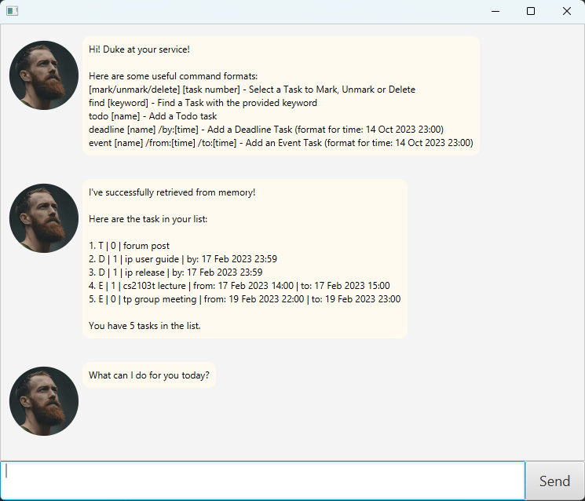

# User Guide

Duke is a **desktop app for managing tasks**. Users input their commands via a Command Line Interface (CLI), but can view
their information with the help of a Graphical User Interface (GUI). Tailored to suit fast-typers, Duke can provide you with a more 
efficient way to manage your daily tasks.

- Quick Start
- Features
  - Adding a Todo task : `todo`
  - Adding a Deadline task : `deadline`
  - Adding a Event task : `event`
  - View all tasks : `list`
  - Deleting a task : `delete`
  - Updating a task : `update`
  - Marking a task as completed : `mark`
  - Unmarking a task as incomplete : `unmark`
  - Locating tasks by name : `find`
  - Exiting the program : `bye`
  - Saving the data
- Command Summary

## Quick Start

1. Ensure you have Java `11` or above installed in your Computer. 


2. Download the latest `duke.jar`.


3. Open the jar file and run the application.

   A GUI similar to the below should appear in a few seconds. Note how the app contains some sample data.

   


4Type the command in the command box and press Enter to execute it. e.g. typing help and pressing Enter will open 
   the help window. Some example commands you can try:
   - `list` : Lists all task
   - `todo [name]` : Adds a `todo` task
   - `deadline [name] /by:[time]` : Adds a `deadline` task
   - `event [name] /from:[time] /to:[time]` : Adds a `event` task
   - `delete 2` : Deletes the second task shown in current list
   - `bye` : Exits the app


6. Refer to the Features below for details of each command.

## Features

### Adding a Todo task : `todo`

Add a Todo task to Duke. A Todo task is a task that need to be completed.

Format: `todo [name]`

Example: `todo forum post`

### Adding a Deadline task : `deadline`

Add a Deadline task to Duke. A Deadline task is a task that needs to be completed before a specific deadline.

Format: `deadline [name] /by:[time]`

- `[time]` needs to be in format: DD MMM YYYY HH:MM (e.g 17 Feb 2023 20:00)

Example: `deadline ip /by:17 Feb 2023 23:59`

### Adding a Event task : `event`

Add an Event task to Duke. An Event task is a task that is done within a specific timing.

Format: `event [name] /from:[time] /to:[time]`

- `[time]` needs to be in format: DD MMM YYYY HH:MM (e.g 17 Feb 2023 20:00)

Example: `event tp group meeting /from:19 Feb 2023 22:00 /to:19 Feb 2023 23:00`

### View all tasks : `list`

Shows a list of all tasks in Duke.

Format: `list`

Expected Output:

```
Here are the task in your list:

1. T | 0 | forum post
2. D | 0 | ip | by: 17 Feb 2023 23:59
3. E | 0 | tp group meeting | from: 19 Feb 2023 22:00 | to: 19 Feb 2023 23:00

You have 3 tasks in the list.
```

### Deleting a task : `delete`

Deletes the specified task from Duke.

Format: `delete [index]`

- Deletes the task at specified `[index]`
- The index refers to the index number shown in the task list displayed by list command
- The index **must be a positive integer** 1, 2, 3, ...

Example: `list` followed by `delete 1` deletes the 1st task in Duke

### Updating a task : `update`

Edits an existing task in the Duke.

Format: `update [index] /[item]:[new info]`

- Updates value of `[item]` in the task at specified `[index]` to `[new info]`
- The index refers to the index number shown in the task list displayed by list command
- The index **must be a positive integer** 1, 2, 3, ...
- The item refers to the specific detail chosen task to modify
  - For a `todo` task, user can modify `name` (name of task)
  - For a `deadline` task, user can modify `name` (name of task) and `by` (deadline of task)
  - For an `event` task, user can modify `name` (name of task), `from` (start timing of task) 
  and `to` (end timing of task)
- The new info refers to the new information to update task with

Examples: `list` followed by `update 1 /name:forum` updates the name of first task in displayed list to "forum"

### Marking a task as completed : `mark`

Marks an existing task in the Duke as completed.

Format: `mark [index]`

- Marks the task at specified `[index]` as completed
- The index refers to the index number shown in the task list displayed by list command
- The index **must be a positive integer** 1, 2, 3, ...

Example: `list` followed by `mark 1` marks the first task in displayed list as completed

### Unmarking a task as incomplete : `unmark`

Unmarks an existing task in the Duke as incomplete.

Format: `unmark [index]`

- Unmarks the task at specified `[index]` as incomplete
- The index refers to the index number shown in the task list displayed by list command
- The index **must be a positive integer** 1, 2, 3, ...

Example: `list` followed by `unmark 1` marks the first task in displayed list as incomplete

### Locating tasks by name : `find`

Finds all tasks whose names contain any of the given keywords.

Format: `find [keyword]`

- The search is case-sensitive (eg. `ip` will not match `IP`)
- Only the name of the tasks is searched
- Only full words will be matched (eg. `ip` will not match `ipduke`)

Example: If `list` displays the list below, `find level` would display the following tasks

```
## Output of list command

Here are the task in your list:

1. T | 0 | forum post
2. D | 0 | ip level 1 | by: 17 Feb 2023 23:59
3. D | 0 | ip level 2 | by: 17 Feb 2023 23:59
4. E | 0 | dissussion on ip level 10 | from: 17 Feb 2023 22:00 | to: 17 Feb 2023 23:00
5. E | 0 | tp group meeting | from: 19 Feb 2023 22:00 | to: 19 Feb 2023 23:00

You have 5 tasks in the list.

## Output of find level command

Here are the matching tasks in your list:

1. D | 0 | ip level 1 | by: 17 Feb 2023 23:59
2. D | 0 | ip level 2 | by: 17 Feb 2023 23:59
3. E | 0 | dissussion on ip level 10 | from: 17 Feb 2023 22:00 | to: 17 Feb 2023 23:00

You have 3 matching tasks in the list.
```

### Exiting the program : `bye`

Exits the program.

Format: `exit`

### Saving the data

Duke data are saved in the hard disk automatically after any command that changes the data. 
There is no need to save manually.

## Command Summary

| Action           | Format                                 | Examples                                                             |
|------------------|----------------------------------------|----------------------------------------------------------------------|
| **add todo**     | `todo [name]`                          | `todo forum post`                                                    |
| **add deadline** | `deadline [name] /by:[time]`           | `deadline ip /by:17 Feb 2023 23:59`                                  |
| **add event**    | `event [name] /from:[time] /to:[time]` | `event tp group meeting /from:19 Feb 2023 22:00 /to:19 Feb 2023 23:00`|
| **list**         | `list`                                 |                                                                      |
| **delete**       | `delete [index]`                       | `delete 1`                                                           |
| **update**       | `update [index] /[item]:[new info]`    | `update 1 /name: ip level 1`                                         |
| **mark**         | `mark [index]`                         | `mark 1`                                                             |
| **unmark**       | `unmark [index]`                       | `unmark 1`                                                           |
| **find**         | `find [keyword]`                       | `find level`                                                         |
| **exit**         | `bye`                                   |                                                                      |
