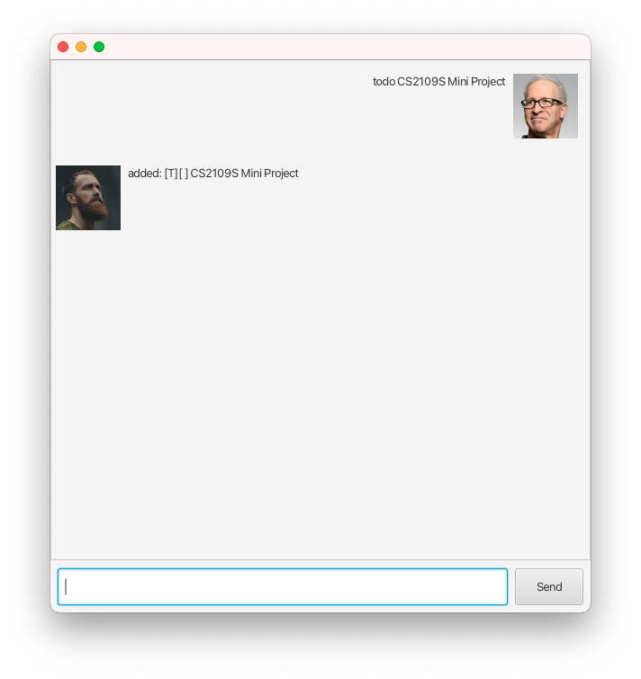
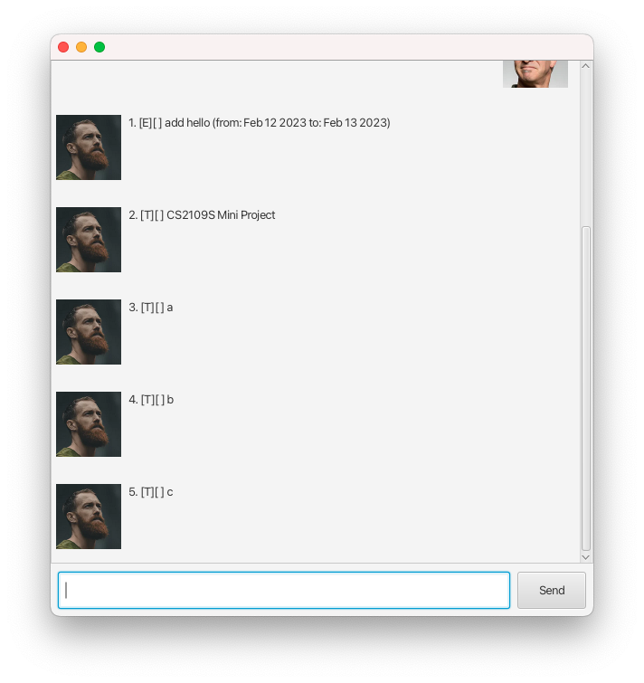
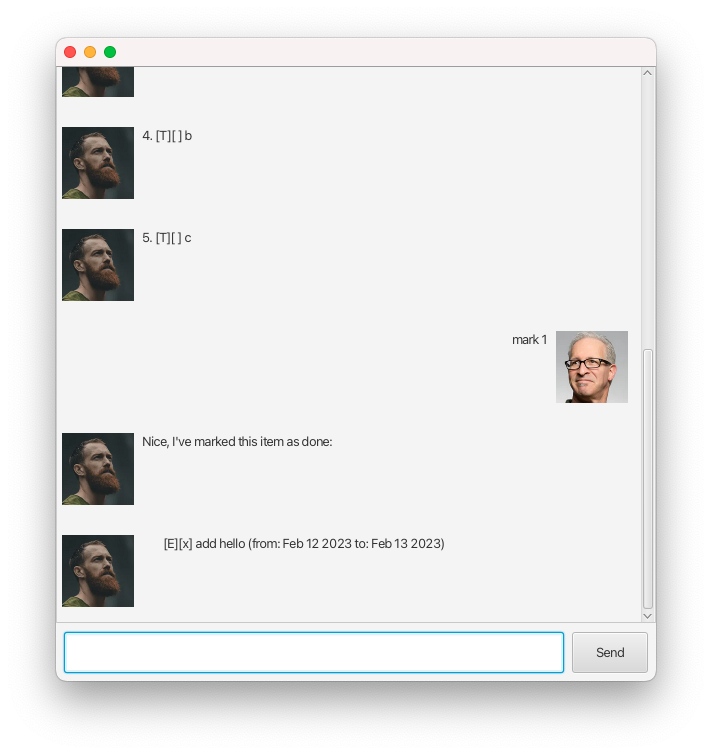
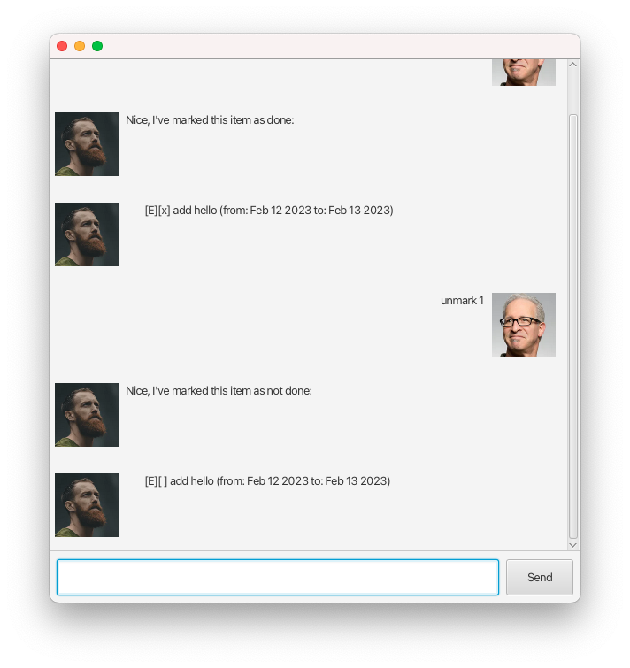
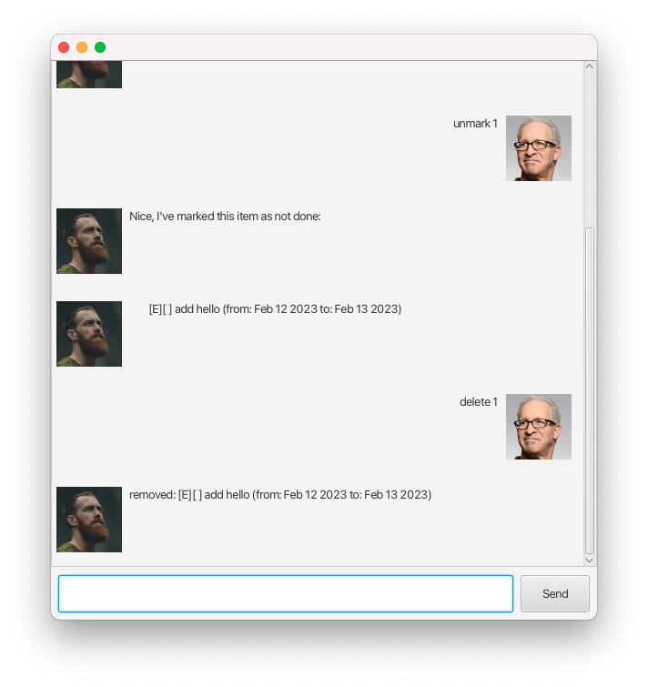

# User Guide


## Features

### Feature-Task Manager

Duke can help you manage 3 types of tasks:

- Deadline: a task that has a ddl;
- Todo: a normal task;
- Event: a task that has a start time and an end time.

It also supports other features such as echoing what you've said,
but they are disabled. Feel free to enable them yourself, the
details of which I am too lazy to write about.

## Usage

### `todo` - Adds a todo

This will add a todo to the task list that duke persists.

Example of usage:

``` 
todo CS2109S Mini Project
```

Expected outcome:

```
added: [T][ ] CS2109S Mini Project
```



Duke will tell you that it has added the task.

### `deadline` - Adds a deadline.

This will add a deadline to the task list. Please remember to
include the `/by` command, after-with a date of the style `YYYY-MM-DD`
should be passed in.

Example of usage:

```
task add do laundry /by 2023-02-12 
```

### `event` - Adds an event.

This will add an event to the task list. Please remember to
include the `/from` and `/to` command, after-with a date of the
style `YYYY-MM-DD`
should be passed in.

Example of usage:

```
task add do laundry /from 2023-02-12 /to 2023-02-13
```

### `list` - Lists all tasks

This will list all tasks in the task list.

Example of usage:

```
list
```

Expected outcome:



### `mark` - Marks a task as done

This will mark a task as done. To use this command, you will need to specify
the index of the task you want to mark as done.

Example of usage:

```
mark 1
```

Expected outcome:



### `unmark` - Marks a task as undone

This will mark a task as undone. To use this command, you will need to specify
the index of the task you want to mark as undone.

Example of usage:

```
unmark 1
```

Expected outcome:


### `delete` - Deletes a task

This will delete a task. To use this command, you will need to specify
the index of the task you want to delete.

Example of usage:

```
delete 1
```

Expected outcome:


