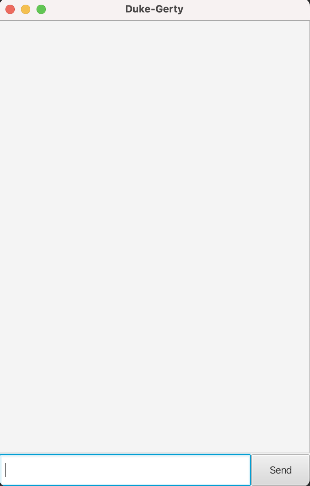

# User Guide for Duke-Gerty

Duke-Gerty is a chatbot designed to help users keep track of various tasks with and without deadlines. This is project developed for the NUS CS module CS2103T in AY2223 Sem2. Refer to [Project Duke](https://github.com/nus-cs2103-AY2223S2/ip) for more details.

- [Quick Start](#quick-start)
- [Features](#features)
    * [Adding a Todo Task](#adding-a-todo-task): `todo`
    * [Adding a Deadline Task](#adding-a-deadline-task): `deadline`
    * [Adding an Event Tasks](#adding-an-event-task): `event`
    * [Listing All Tasks](#listing-all-tasks): `list`
    * [Marking Task as done](#marking-task-as-done): `mark`
    * [Unmarking Task as not done](#unmarking-task-as-not-done): `unmark`
    * [Deleting a Task](#deleting-a-task): `delete`
    * [Finding Tasks by description](#finding-tasks-by-description): `find`
    * [Bye](#bye): `bye`
- [FAQ](#faq)
- [Command Summary](#command-summary)

## Quick Start

Ensure you have Java `11` or above installed in your Computer.

Download the latest `Duke-Gerty.jar` from [here](https://github.com/kyueran/ip/releases).

Copy the file to the folder you want to use as the home folder for the jar application.

Open a command terminal, `cd` into the folder you put the jar file in, and use the `java -jar Duke-Gerty.jar` command to run the application.
A GUI similar to the below should appear.
<div align="center">

</div>
Type the command in the command box and either hit Enter on your keyboard or click `Send` to execute it.

When you first launch the application, you can type in anything and a list of commands
instructing you how to record different tasks as shown in the picture at the very top of this guide will appear.

5. Some example commands you can try:

 - `list`: Lists all tasks.


- `todo borrow book`: Adds a task to borrow a book


- `deadline do tutorial 1 /by 12/04/2023 2359`: Adds a task to finish tutorial 1 by 12/04/2023 2359


- `mark 1`: Marks the borrow book task as done


- `delete 1`: Deletes the borrow book task


- `bye`: Exits the jar application

6. Refer to the [Features](#features) below for details of each command.


---

## Features

### Adding a Todo Task

Adds a todo task to the task list.

Format: `todo <description>`

Examples:
- `todo borrow book`
- `todo finish tutorial 1`

### Adding a Deadline Task

Adds a deadline task to the task list.

Format: `deadline <description> /by <DD/MM/YYYY Time>` 

Examples:
- `deadline read book /by 12/04/2023 1400`
- `deadline finish tutorial 1 /by 12/04/2023 6pm`

### Adding an Event Task

Adds an event task to the task list.

Format: `event <description> /from <DD/MM/YYYY Time> /to <DD/MM/YYYY Time>` 

Examples: 
- `event orientation week /from 16/01/2023 3pm /to 23/01/2023 6pm`
- `event assignment 1 /from 10/03/2023 1500 /to 24/03/2023 2359`


### Listing all Tasks

Shows a list of all tasks in the task list.

Format: `list`


### Marking Task as done

Marks a task as done in your task list.

Format: `mark <index>`

Examples: 
- `mark 1`
- `mark 2`


### Unmarking Task as not done

Marks a task as not done in your task list.

Format: `unmark <index>` 

Examples: 
- `unmark 1`
- `unmark 2`

### Deleting a Task

Deletes a task from your task list.

Format: `delete <index>`

Examples:
- `delete 1`
- `delete 2`

### Finding Tasks by description

Finds all tasks matching the description

Format: `find <description>`

Examples:
- `find tutorial`
- `find read`

Sample execution of `find tutorial`:
```
Here are the matching tasks in your list:
 2. [T][ ] tutorial 1
 3. [D][ ] tutorial 2 (by: Apr 12 2023, 1159pm)
 5. [E][ ] revise tutorials (from: Mar 1 2023, 1300 to: Mar 7 2023, 1400)
 ```


### Bye

Exits the program.

Format: `bye`

---

### FAQ
**Q:** How do input the date and time for deadline and event tasks?

**A:** The format is DD/MM/YYYY Time, and the Time is very flexible (eg. 12/04/2023 1800, 12/04/2023 18:00, 12/04/2023 6pm).

---

## Command Summary

|          Action           |                               Format                                |                             Example                             |
|:-------------------------:|:-------------------------------------------------------------------:|:---------------------------------------------------------------:|
|      Add a Todo task      |                        `todo <description>`                         |                        `todo tutorial 1`                        |
|    Add a Deadline task    |           `deadline <description> /by <DD/MM/YYYY Time>`            |           `deadline tutorial 2 /by 12/04/2023 1159pm`           |
|     Add an Event task     | `event <description> /from <DD/MM/YYYY Time> /to <DD/MM/YYYY Time>` | `event revise tutorials /from 1/03/2023 1300 /to 7/03/2023 1400` |
|      List all Tasks       |                               `list`                                |                              `list`                             |
|       Delete a Task       |                        `delete <TaskIndex>`                         |                            `delete 1`                           |
| Find Tasks by description |                        `find <description>`                         |        `find tutorial`  |
|   Marks a Task as done    |                  `mark <TaskIndex>`                   | `mark 1` |
|      Unmarks a Task       |                 `unmark <TaskIndex>`                  | `unmark 1` |
|     Exit Application      |                         `bye`                         | `bye` |
