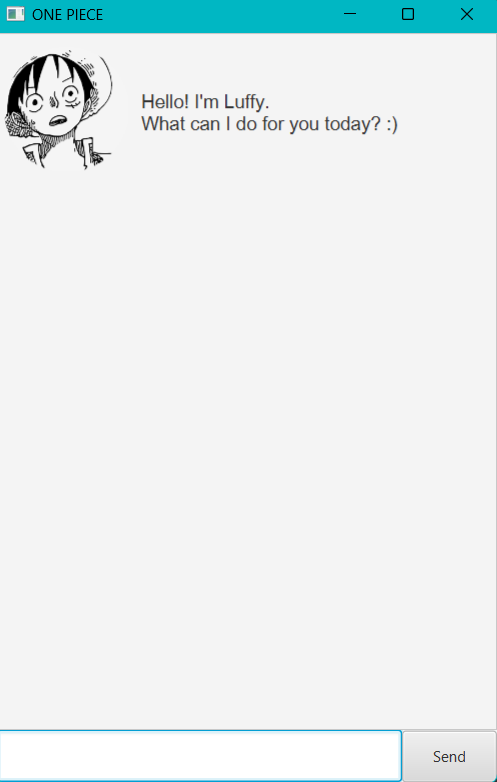

# User Guide
## What is Luffy?
Luffy is a chatbot desktop app for helping you manage tasks and track your deadlines! 
It is optimised for use via a command line interface (CLI) while still having the benefits of
a Graphical User Interface (GUI). If you can type quickly, Luffy can manage your tasks 
faster than a traditional GUI app :)

- [Quick-Start](#quick-start)
- [Features](#features)
   - Adding a task
        - [Adding a todo: `todo`](#adding-a-todo-todo)
        - [Adding a deadline: `deadline`](#adding-a-deadline-deadline)
        - [Adding an event: `event`](#adding-an-event-event)
   - [Marking a task as done: `mark`](#marking-a-task-as-completed-mark)
   - [Marking a task as incomplete: `unmark`](#marking-a-task-as-unfinished-unmark)
   - [Deleting a task: `delete`](#deleting-a-task-delete)
   - [Listing all tasks](#listing-all-tasks-list)
   - [Viewing schedule; `view`](#view-your-schedule-view)
   - [Finding tasks: `find`](#finding-tasks-find)
   - [Exiting/Closing the app: `bye`](#exiting-the-app-bye)
   - [Saving data](#saving-your-data)
   - [Editing (saved) data](#editing-the-data-file)

## Quick Start
1. Ensure you have Java `11` or above installed on your computer.
2. Download the latest `luffy.jar` [here](https://github.com/wendy0107/ip/releases).
3. Copy the file to the folder you want to use as the home folder for Luffy.
4. Double-click the file to start the app. The GUI similar to the image below should appear.

5. Type a command in the command box and click `Enter` for Luffy to run the command!
6. Some example commands to run are:
    * `todo homework`: adds a `todo` to your list.
    * `list`: shows all the tasks you have in your list.
7. Refer to the Features section below for details of each command.

## Features 
### Notes about the features
* Words in `UPPER_CASE` are the parameters/details to be supplied by the user.
 + eg. in `todo TODO_DESCRIPTION` is a parameter which can be used as `todo homework`.
* If more parameters than what is required are specified, Luffy will not be able to run the command.
 + eg. `mark 1 2 3` will not be executed correctly.
* Additional parameters for commands that do not take in parametes will not be executed by Luffy.
 + eg. `list 1 2 3` will not be executed correctly.

### Adding a todo: `todo`
Adds a todo to the list.

**Format**: `todo TODO_DESCRIPTION`

**Example**:
 + `todo revision for exam`
 
### Adding a deadline: `deadline`
Adds a deadline to the list. 
A deadline includes a description and a due date.

**Format**: `deadline DEADLINE_DESCRIPTION /by DUE_DATE`
> **Format for DUE_DATE** : yyyy-mm-dd.
> + eg. 2022-02-02

**Example**:
`deadline cs2103 quiz /by 2022-01-01`

### Adding an event: `event`
Add an event to the list. 
An event includes a description, start date and end date.

**Format**: `event EVENT_DESCRIPTION /from START_DATE /by END_DATE`
> **Format for START_DATE/DUE_DATE** : yyyy-mm-dd
> + eg. 2022-02-02

**Example**:
`event career fair /from 2022-01-01 /by 2022-02-02`

### Marking a task as completed: `mark`
Mark a specified task as completed.

**Format**: `mark TASK_INDEX`
> TASK_INDEX: the index of the task in the list (can be obtained with the `list` command).

**Example**: 

Running `list` to view the tasks' indexes first.
Followed by `mark 1`

### Marking a task as unfinished: `unmark`
Mark a completed task as unfinished.

**Format**: `unmark TASK_INDEX`
> TASK_INDEX: the index of the task in the list (can be obtained with the `list` command).

**Example**
Running `list` to view the tasks' indexes first.
Followed by `unmark 1`

### Deleting a task: `delete`
Deletes the specified task in the list.

**Format** `delete TASK_INDEX`
> TASK_INDEX: the index of the task in the list (can be obtained with the list command).

**Example**:
Running `list` to view the tasks' indexes first.
`delete 3`

### Listing all tasks: `list`
Shows a list of all the tasks added.

**Format** `list`

### View your schedule: `view`
Shows a list of all deadlines and events for a specified date.

**Format** `view DATE`
> **Format for `DATE`**: yyyy-mm-dd
> + eg. 2022-02-02

**Example**
`view 2022-02-02`

### Finding tasks: `find`
Shows a list of tasks containing the specified keyword.

**Format**: `find KEYWORD`

**Example**:
`find one piece`

### Exiting the app: `bye`
Exits and closes the app.

**Format** `bye`

### Saving your data
Luffy's data is saved into the hard disk automatically after any command that changes the data is executed.

### Editing the data file
Luffy's data is saved in a text file `[JAR_file_location]/data/luffy.txt`.   
Advanced users are welcomed to change the data directly by editing the data file.
> CAUTION: If the changes made do not follow the format specified in the data file, Luffy might crash.