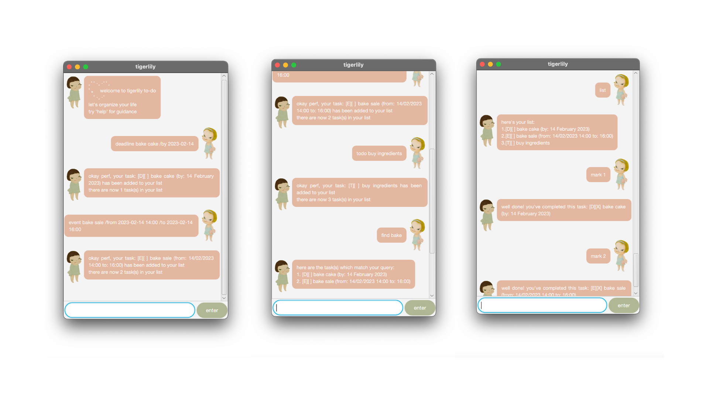

# Tigerlily ❀
Tigerlily is a to-do list chatbot, aimed at helping to ogranize your life better.



## How to use Tigerlily
### 1. `deadline` - Add a Deadline

Adds a Deadline to Tigerlily

Format: 

`deadline [description] /by [due date]`

Example:

`deadline bake cake /by 2023-02-14`

### 2. `event` - Add an Event

Adds an Event to Tigerlily

Format:

`event [description] /from [start time] /by [end time]`

Example: 

`event bake sale /from 2023-02-14 14:00 /to 2023-02-14 16:00`

### 3. `todo` - Add a ToDo

Adds a ToDo to Tigerlily

Format: 

`todo [description]`

Example: 

`todo buy ingredients`

### 4. `find` - Find Tasks

Finds Tasks related to query word

Format: 

`find [query word]`

Example: 

`find bake`

Expected outcome:

```
here are the task(s) which match your query:
1. [D][] bake cake (by: 14 February 2023)
2. [E][] bake sale (from: 14/02/2023 14:00 to 16:00)
```

### 5. `list` - List Tasks

Lists all Tasks in Tigerlily

Format:

`list`

Expected outcome:

```
here's your list:
1. [D][] bake cake (by: 14 February 2023)
2. [E][] bake sale (from: 14/02/2023 14:00 to 16:00)
3. [T][] buy ingredients
```

### 6. `delete` - Delete a Task

Deletes a specified Task from Tigerlily

Format:

`delete [index # of Task]`

Example: 

`delete 1`

Expected outcome:

```
okay, this task has been removed: [D][] bake cake (by:
14 February 2023)
the list now has 2 task(s) left
```

### 7. `mark` - Mark a Task as Completed

Marks corresponding Task as completed

Format:

`mark [index # of Task]`

Example:

`mark 1`

Expected outcome:

```
well done! you've completed this task: [D][X] bake cake (by:
14 February 2023)
```

### 8. `unmark` - Unmark a Task as Completed

Marks corresponding Task as completed

Format:

`unmark [index # of Task]`

Example:

`unmark 1`

Expected outcome:

```
oops...this task is now marked as not done yet: [D][] bake cake (by:
14 February 2023)
```

### 9. `help` - Get Help

Displays guide for Tigerlily users on possible commands

Format:

`help`

### 10. `bye` - Exit Tigerlily

Exits Tigerlily and saves all updates made

Format:

`bye`