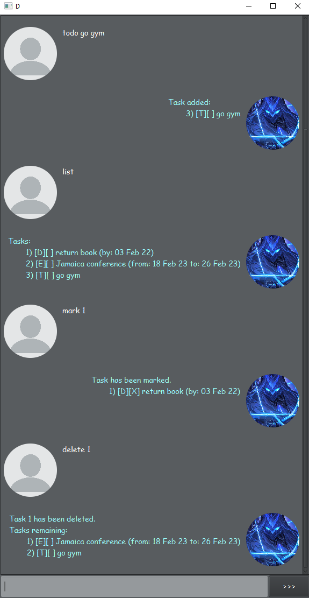
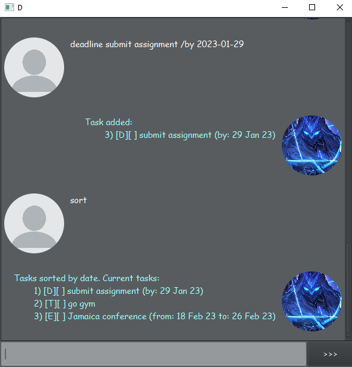
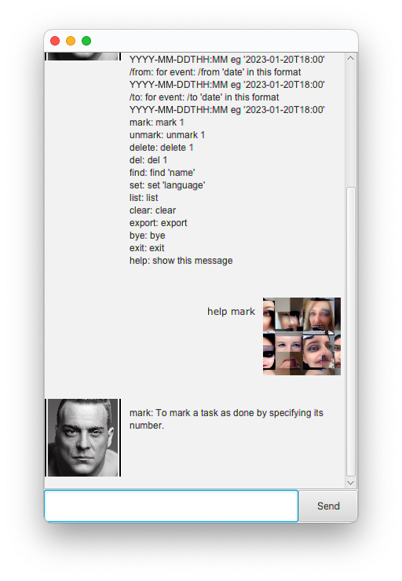

# User Guide

## Features 

### Task Tracking

Add different categories of tasks to the list. 
Tasks can be marked, unmarked, or deleted.
Find tasks by keywords or date.

ChatBot will remember tasks next time app is opened.

### Sort Tasks

Tasks with date info can be sorted in ascending order. Tasks without date info will remain in the same spot.

## Usage

### `help` 

Prompts bot to provide more info about commands.

Example of usage: 

`help 'command'`

`help all`

`help`

All details and formats for other commands could be obtained using `help`
