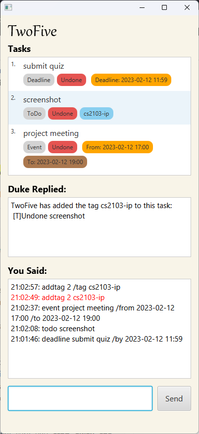
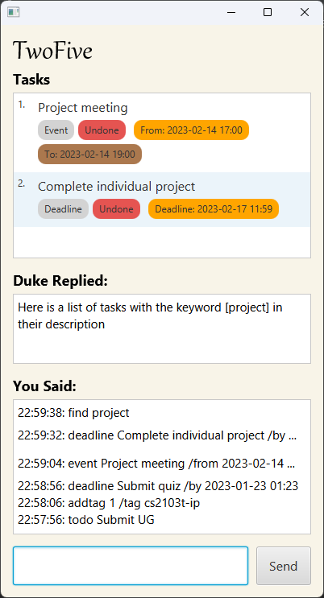
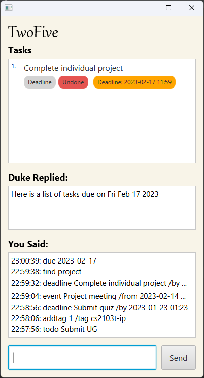
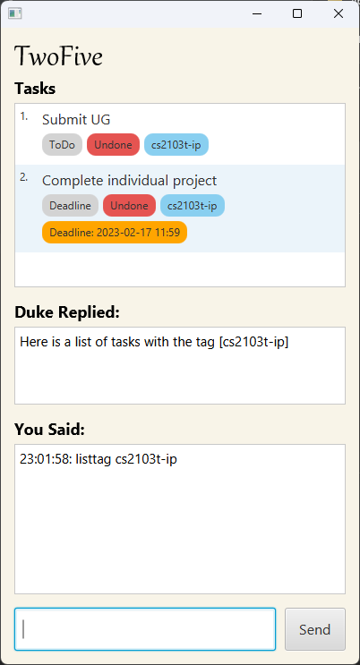
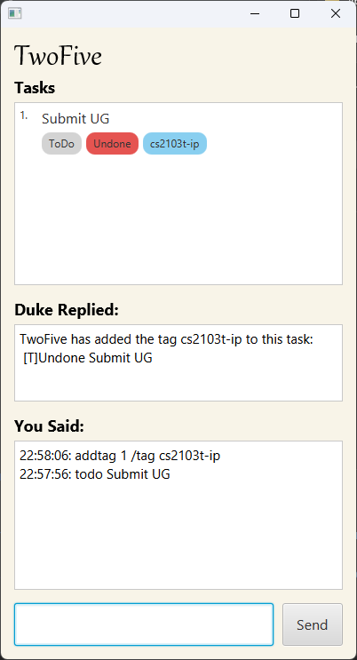

# User Guide

TwoFive is a chatbot for **managing your daily tasks**, which can be a **todo, deadline or event task**. TwoFive provides an optimized workflow by offering a hybrid mode of interaction, with **commands entered via a Command Line Interface (CLI)**, and results displayed in a Graphical User Interface (GUI). Type up to speed and TwoFive will let you manage your tasks faster than pure GUI apps.

- [Get started](#get-started)
- [Features](#features)
  - [Adding a todo task: `todo`](#adding-a-todo-task-todo)
  - [Adding a deadline task: `deadline`](#adding-a-deadline-task-deadline)
  - [Adding a event task: `event`](#adding-an-event-task-event)
  - [Marking a task as done: `mark`](#marking-a-task-as-done-mark)
  - [Marking a task as undone: `unmark`](#marking-a-task-as-undone-unmark)
  - [Listing all added tasks: `list`](#listing-all-tasks-list)
  - [Locating tasks by keyword: `find`](#locating-tasks-by-keyword-find)
  - [Listing tasks with a specific due date: `due`](#listing-tasks-with-a-specific-due-date-due)
  - [Listing tasks with a specific tag: `listtag`](#listing-tasks-with-a-specific-tag-listtag)
  - [Deleting a task: `delete`](#deleting-a-task-delete)
  - [Adding a tag: `addtag`](#adding-a-tag-addtag)
  - [Exiting the chatbot: `bye`](#exiting-the-chatbot-bye)
- [Command summary](#command-summary)

---

## Get Started
1. Ensure you have Java `11` installed on your computer.
2. Download the latest `TwoFive.jar` from [here](https://github.com/jianminglok/ip/releases).
3. Copy the downloaded `JAR` file to the folder you want to use as the *home folder* for TwoFive.
4. Double click `TwoFive.jar` to run the application. Alternatively, open a command terminal, `cd` into the folder you 
put the jar file in, and use the command `java -jar TwoFive.jar` to run the application.

A GUI Similar to the one shown below should appear within a few seconds. The screenshot shown below contains some sample 
data, while yours should be empty.

5. Type the command in the command box and press enter to execute it. 
Some examples you can try: 
   * `list`: List all tasks added.
   * `todo Submit quiz`: Adds a todo task with the description `Submit quiz`.
   * `delete 3`: Deletes the 3rd task.
   * `bye`: Exits the application.
6. Refer to the [Features](#features) below for details of each command.

---

## Features 

### Adding a todo task: `todo`

Adds a todo task with a description.

Format: `todo DESCRIPTION`

Examples:
- `todo Submit quiz` adds a todo task with the description `Submit quiz`.
- `todo Complete resume` adds a todo task with the description `Complete resume`.

### Adding a deadline task: `deadline`

Adds a deadline task with a description and a deadline.

Format: `deadline DESCRIPTION /by DEADLINE`
- `DEADLINE` **must be in** `YYYY-MM-DD HH:mm` format, i.e. time is in **24 hours** format.

Examples:
- `deadline Submit quiz /by 2023-01-23 01:23` adds a deadline task with the description `Submit quiz` and deadline
  `2023-01-23 01:23`.
- `deadline Complete resume /by 2023-02-14 20:13` adds a deadline task with the description `Complete resume` and 
  deadline `2023-02-14 20:13`.

### Adding an event task: `event`

Adds an event task with a description, a start time and an end time.

Format: `event DESCRIPTION /from START_TIME /to END_TIME`
- `START_TIME` and `END_TIME` **must be in** `YYYY-MM-DD HH:mm` format, i.e. time is in **24 hours** 
  format.

Examples:
- `event Project meeting /from 2023-02-14 17:00 /to 2023-02-14 19:00` adds an event task with the description 
  `Project meeting`, starting time `2023-02-14 17:00` and ending time `2023-02-14 19:00`.
- `event CS2103T Tutorial /from 2023-02-15 15:00 /to 2023-02-15 16:00` adds an event task with the description
  `CS2103T Tutorial`, starting time `2023-02-15 15:00` and ending time `2023-02-15 16:00`.

### Marking a task as done: `mark`

Marks an uncompleted task with the given index as completed.

Format: `mark INDEX`
- Marks the task at the specified `INDEX` as done.
- The index **must be a positive integer** 1, 2, 3, …

Examples:
- `mark 1` marks the 1st task in the list as completed.
- `mark 3` marks the 3rd task in the list as completed.

### Marking a task as undone: `unmark`

Marks a completed task with the given index as not completed.

Format: `unmark INDEX`
- Marks the task at the specified `INDEX` as undone.
- The index **must be a positive integer** 1, 2, 3, …

Examples:
- `unmark 1` marks the 1st task in the list as uncompleted.
- `unmark 3` marks the 3rd task in the list as uncompleted.

### Listing all tasks: `list`

Shows a list of all tasks added.

Format: `list`

### Locating tasks by keyword: `find`

Find tasks which has the keyword in their descriptions.

Format: `find KEYWORD`

Example:
- `find quiz` lists all tasks with the keyword `quiz` in their description.
- `find project` lists all tasks with the keyword `project` in their description.

### Listing tasks with a specific due date: `due`

Find all deadline and event tasks with deadline, start time or end time on the given date.

Format: `due DUE_DATE`
- `DUE_DATE` **must be in** `YYYY-MM-DD` format. 

Example:
- `due 2023-02-01` lists all deadline and event tasks that are due on `2023-02-01`.
- `due 2023-02-14` lists all deadline and event tasks that are due on `2023-02-24`.

### Listing tasks with a specific tag: `listtag`

Find tasks which has the specified tag.

Format: `listtag TAG`

Example:
- `listtag cs2103t-ip` lists all tasks with the tag `cs2103t-ip`.
- `listtag python` lists all tasks with the tag `python`.

### Deleting a task: `delete`

Deletes the specified task.

Format: `mark INDEX`
- Deletes the task at the specified `INDEX`.
- The index **must be a positive integer** 1, 2, 3, …

Examples:
- `delete 1` deletes the 1st task in the list.
- `delete 3` deletes the 3rd task in the list.

### Adding a tag: `addtag`

Adds a specified tag to the specified task.

Format: `addtag INDEX /tag TAG`
- Adds the tag `TAG` to the task at the specified `INDEX`.
- The index **must be a positive integer** 1, 2, 3, …

Examples:
- `addtag 1 /tag cs2103t-ip` adds the tag `cs2103t-ip` to the 1st task in the list.
- `addtag 3 /tag python` adds the tag `python` to the 3rd task in the list.

### Exiting the chatbot: `bye`

Exits the application.

Format: `exit`

## Command summary

Action | Format, Examples
--------|------------------
**Add todo task** | `todo DESCRIPTION`   e.g., `todo Submit quiz`
**Add deadline task** | `deadline DESCRIPTION /by DEADLINE`   e.g., `deadline Submit quiz /by 2023-01-23 01:23`
**Add event task** | `event DESCRIPTION /from START_TIME /to END_TIME`   e.g., `event Project meeting /from 2023-02-14 17:00 /to 2023-02-14 19:00`
**Add tag** | `addtag INDEX /tag TAG`   e.g., `addtag 1 /tag cs2103t-ip`
**Mark** | `mark INDEX`  e.g., `mark 1`
**Unmark** | `unmark INDEX`  e.g., `unmark 1`
**Delete** | `delete INDEX`  e.g., `delete 1`
**List** | `list`
**Find by keyword** | `find KEYWORD`  e.g., `find quiz`
**Find by due date** | `due DUE_DATE`  e.g., `due 2023-02-14`
**Find by tag** | `listtag TAG`  e.g., `listtag cs2103t-ip`
