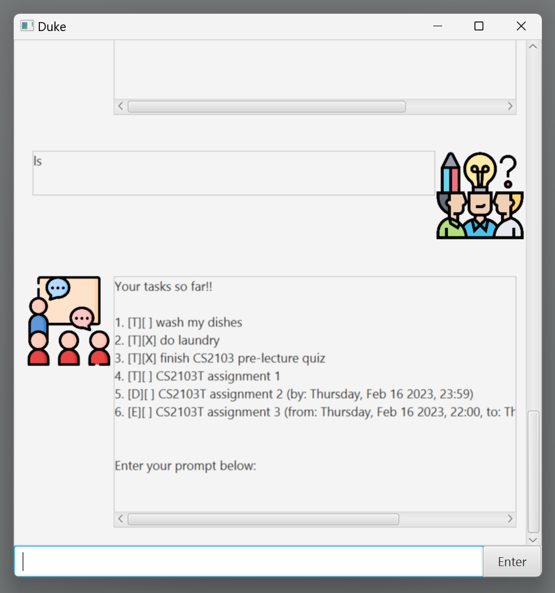

# Duke: User Guide

Welcome to Duke! Your preferred task management platform.

Duke supports the storing of tasks with/without deadlines, as well as events that are time-sensitive!

Tasks without deadlines are called ***ToDo***. 
Tasks with deadlines are called ***Deadline***. 
Tasks with start and end timings are called ***Event***.

## Contents
* Quick Start
* Features
  * Add task
    * ToDo
    * Deadline
    * Event
  * List tasks
  * Mark task
  * Unmark task
  * Delete task
  * Find task
* Exiting the application

## Quick Start
* Make sure that you have `Java 11` or above installed on your computer. 
* Download the latest jar file (`duke-v0.2.jar`) from our
Github Releases ([link here](https://github.com/praveenkrishna0512/ip/releases))
* Place the jar file into a new folder. This folder will be used as the home folder for Duke. 
* Open a command terminal within the home folder.
  * The option to do so should be within the context menu that pops up when
  you right-click within the folder.
* Enter `java -jar duke-v0.2.jar` in the command terminal.
  * You should notice the GUI of the application pop up.
* You are ready to use Duke!
  * Refer to the Features section below for details on each command!

## Features
Below, you can find the description and usage of each command within Duke.

### `Add Task` - Adds a task to the task list
There are 3 types of tasks within Duke; namely ToDo, Deadline, and Event. 
Thus, there are 3 different commands to add these 3 types of tasks.
We will now cover how to add each of these types of tasks.

#### `ToDo` - Adds a ToDo task to the task list
Command: `todo <name of task>` or `t <name of task>`

A ToDo task has no time restrictions.
The command above adds a ToDo task to your task list.

Example usage: `todo CS2103T assignment 1`

Expected output:
A response from Duke will acknowledge the addition of the task.

 
 
 
#### `Deadline` - Adds a Deadline task to the task list
Command: `deadline <name of task> /by <deadline>` or `d <name of task> /by <deadline>`

A Deadline task has a deadline. 
The command above adds a Deadline task to your task list.

Remember to use the following format for the deadline field: ***yyyy-MM-dd HH:mm***

Example usage: `deadline CS2103T assignment 2 /by 2023-02-16 23:59`

Expected output: A response from Duke will acknowledge the addition of the task.

 
 
 
#### `Event` - Adds an Event task to the task list
Command: `event <name of task> /from <startDateTime> /to <endDateTime>`
or `e <name of task> /from <startDateTime> /to <endDateTime>`

An Event task has a start and end timing.
The command above adds an Event task to your task list.

Remember to use the following format for the
startDateTime and endDateTime field: ***yyyy-MM-dd HH:mm***

Example usage: `event CS2103T assignment 3 /from 2023-02-16 22:00 /to 2023-02-16 23:59`

Expected output: A response from Duke will acknowledge the addition of the task.

 
 
 
### `List Tasks` - Lists all task in your task list
Command: `list` or `ls`

The command above lists all the tasks within your task list.

Example usage: `ls`

Expected output:
A response from Duke will display all the tasks in your task list.
The number of the list item corresponding to the task is the ***task's index***.

 
 
 
### `Mark Task` - Mark a task as complete
Command: `mark <index-of-task>` or `m <index-of-task>`

The command above marks a task as complete.
The task will be specified by the `index-of-task` argument.
*To check the index of a specific task, type in `ls` and look at task's
assigned number within Duke's response.*

Example usage: `mark 1`

Expected output: A response from Duke will acknowledge your command to mark the task as done.
It will also display the current status of the task.

 
 
 
### `Unmark Task` - Mark a task as incomplete
Command: `unmark <index-of-task>` or `um <index-of-task>`

The command above marks a task as incomplete.
The task will be specified by the `index-of-task` argument.
*To check the index of a specific task, type in `ls` and look at task's
assigned number within Duke's response.*

Example usage: `unmark 1`

Expected output: A response from Duke will acknowledge your command to mark the task as incomplete.
It will also display the current status of the task.

 
 
 
### `Delete Task` - Deletes a task
Command: `delete <index-of-task>` or `del <index-of-task>`

The command above deletes a task from the task list.
The task will be specified by the `index-of-task` argument.
*To check the index of a specific task, type in `ls` and look at task's
assigned number within Duke's response.*

***Note: This action is IRREVERSIBLE. Please be cautious when you use this command.***

Example usage: `del 1`

Expected output: A response from Duke will acknowledge your command to delete the task.
It will also display the status of the removed task.

 
 
 
### `Find Task` - Find a task
Command: `find <keyword>` or `f <keyword>`

The command above will display tasks that match the keyword provided.

Example usage: `f CS2103`

Expected output: A response from Duke will display tasks that match the keyword provided.

 
 
 
## Exiting the application

There are 2 safe ways to exit the application and ensure proper storage of your task list.
1. Type `bye` within the input field provided at the bottom of the application window.
2. Press the exit button at the top right of the application window.

***Please follow these to avoid any loss of data.***