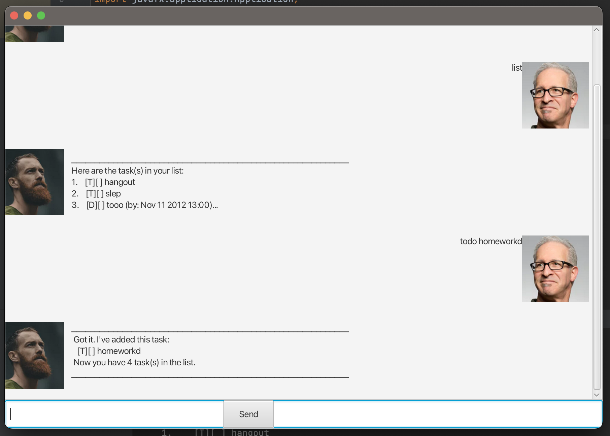

# User Guide
## Dukie
> “The way to get started is to quit talking and begin doing.”  – Walt Disney [(source)](https://blog.hubspot.com/sales/famous-quotes)

The app is so **easy to use**, you can even use it while doing a dookie.

Dukie frees your mind of having to remember things you need to do. It's,

* text-based
* easy to pick up
* ~FAST~ SUPER FAST to use

Dukie currently supports the following functions:

* [x]  Managing tasks
* [x]  Managing deadlines
* [x]  Managing event details
* [x]  Find any task / deadline / event

## Instructions for Installation

All you need to do is,

1. download it from [here](https://github.com/securespider/ip.git).
2. double-click it.
3. add your tasks.
4. let it manage your tasks for you 😉

## Features

### Manage tasks

With Dookie, you can keep track of 3 types of tasks: *Todos*, *Events* and *Deadlines*.
You can create, delete or mark the tasks as done

### Search for tasks

Dookie can help you search for tasks stored in your task list based on the keyword you enter!

### Change storage location

Do not settle for a fixed file location.
Customise the location that you want to store the tasks in!

## Usage

### Adding a Todo task

Adds a ToDo task to the list.

Format: `todo <description>`

Examples:

- `todo Read book`

### Adding a Deadline

Format: `deadline <description> /by <datetime>`

Examples:

-`deadline play basketball /by 2022-09-20`

### Adding an Event

Format: `event <description> /from <datetime> /to <datetime>`

Examples:

-`event read books /from 11/1/2001 /to 22/2/2022 0600`

### Mark a task

Marks a task as done.

Format:  `mark <task id>`
Examples:

-`mark 1`

### Delete a task

Deletes a task according to the number

Format:  `delete <task id>`

Examples:

-`delete 1` Deletes the first task.

### Find a task

Finds a task according to the keyword

Format:  `find <keyword>`

Examples:

-`find play` Find the tasks containing keyword play

### Save the file

Change the file for the tasks to be saved.
Default storage location is ./tasks.txt 

Format: `save <filename>`

Examples:

-`save ./text.txt` When the chatbot is closed the information will be saved in text.txt

### Close the app

Closes the duke chatbox and saves the data to your file.

Format:  `bye`

Examples:

-`bye` 

