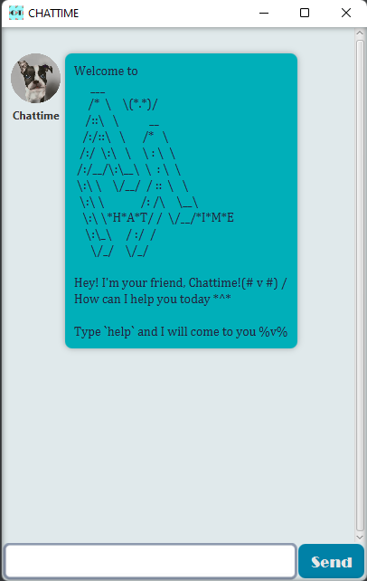
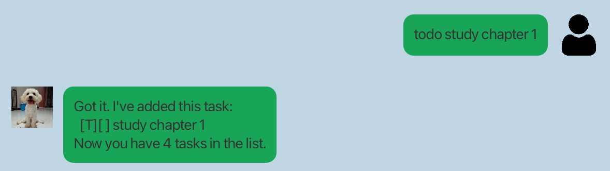
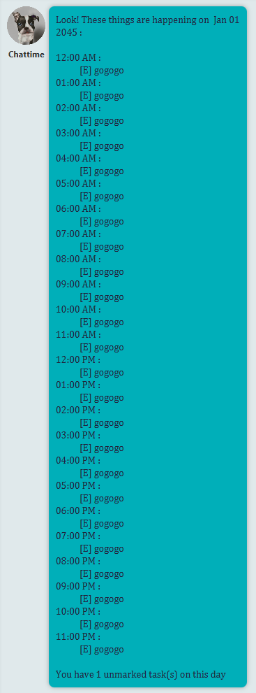

# Chattime User Guide
---
> It's Chattime! Welcome to the chat world! @^@

## Introduction
Have a nice organized day start with an easy chat with our bot! Chattime is a command-line interface (CLI) bot that aims
to keep track of user's to-do list. Chattime provides various functions that help user to manage daily tasks.
> **Note**
> New update : Chattime is now available with Graphic User Interface(GUI).

## Features Menu
- [Quick start](#quick-start)

- [Features](#features)
  - [Viewing bot guide : `help`](#viewing-bot-guide)
  - [Adding tasks](#adding-tasks)
    - [Plain task : `todo`](#todo---adds-plain-task)
    - [Task with deadline : `deadline`](#deadline---adds-task-with-deadline)
    - [Task with time period : `event`](#event---adds-task-takes-place-over-a-certain-period)
  - [List current available tasks](#list-current-available-tasks)
    - [All task : `list`](#list---list-all-tasks)
    - [One-day schedule : `schedule`](#schedule---lists-one-day-schedule)
  - [Edit task progress](#edit-task-progress)
    - [Set task done : `mark`](#mark---set-task-done)
    - [Set task not done : `unmark`](#unmark---reverts-task-done)
  - [Delete a task : `delete`](#delete-a-task-from-the-task-list)
  - [Search tasks](#search-tasks)
    - [By keyword : `find`](#find---by-keyword)
    - [By time : `listTime`](#listtime---by-time)
  - [Exit the bot : `bye`](#exiting-the-program)
  
- [Command Summary](#command-summary)

## Quick start
1. Have Java 11 or above installed in local laptop or computer.
2. Download the latest version (chattime v1.0) of chattime.jar from [here](https://github.com/laihuiqi/ip/releases/tag/A-Release).
3. Double-click on the downloaded chattime.jar file.
4. You should see the bot is running now. The GUI should show a greeting screen.

5. Type the command in text box, press enter or Send button to execute it. You can type `help` first to view the user 
   guide.
6. For more detail explanation, please refer to the [Features](#features) section below.

> **Warning**
> Chat data is stored in /data/chattimeTask.txt  

## Features
### Viewing bot guide
---
Displays help message containing a compact list of commands and their input formats that are accepted by Chattime.

#### Usage
---
#### `help` - Displays help message
---
Displays help message with available commands and their respective input formats.

Format : `help`

Example of usage:

`help`

Expected outcome:

### Adding tasks
---
Adds task with type To-do, Deadline or Event to the task list. A confirmation message will be displayed by Chattime if 
the task is added successfully. 
> **Note**
>Default : All task is not done.

> **Note**
>Same tasks can be added only once.

#### Usage
---
#### `todo` - Adds plain task
---
Adds a To-do task to the task list.

Format : `todo <taskname>`

Example of usage:

`todo jogging` 

Expected outcome:

#### Usage
---
#### `deadline` - Adds task with deadline
---
Adds a Deadline task to the task list. A Deadline task should be completed `/by` some time.

Format : `deadline <taskname> /by <date in yyyy-mm-dd or yyyy-mm-dd hh:mm>`

Example of usage:

`deadline hw1 /by 2023-03-23`
`deadline hw2 /by 2023-03-25 17:00`

Expected outcome:

#### Usage
---
#### `event` - Adds task takes place over a certain period
---
Adds an Event task to the task list. An Event task should start `/from` start time `/to` end time.

Format : `event <task> /from <date in yyyy-mm-dd or yyyy-mm-dd hh:mm> /to <date in yyyy-mm-dd or yyyy-mm-dd hh:mm>`
> **Note**
Default : If not inputted, start time is 00:00, end time is 23:59, both dates are required fields.

Example of usage:

`event student life fair /from 2023-08-08 /to 2023-08-10`
`event cs2103 lecture /from 2023-02-10 14:00 /to 2023-02-10 16:00`

Expected outcome:

### List current available tasks
---
Lists the tasks currently stored in the task list.

#### Usage
---
#### `list` - List all tasks 
---
Lists all the tasks in the task list.

Format : `list`

Example of usage:

`list`

Expected outcome:

#### Usage
---
#### `schedule` - Lists one-day schedule 
---
Lists all the `unmarked` tasks in a specific day in an hourly manner.

Format : `schedule <date in yyyy-mm-dd>`

Example of usage:

`schedule 2045-01-01`

Expected outcome:

### Edit task progress
---
`mark` when task is done, `unmark` when it is no done.

#### Usage
---
#### `mark` - Set task done 
---
Marks a specific task as done.

Format : `mark <index>`
> **Note**
`<index>` is the sequential index of the task in the list, the index number can be revised using `list`.

Example of usage:

`mark 17`

Expected outcome:

#### Usage
---
#### `unmark` - Reverts task done
---
Reverts the `done mark` on the task. Marks task as not done.

Format : `unmark <index>`
> **Note**
> `<index>` is the sequential index of the task in the list, the index number can be revised using `list`.

Example of usage:

`unmark 171`

Expected outcome:

### Delete a task from the task list
---
Delete an unwanted or wrongly input task from the task list.

#### Usage
---
#### `delete` - Delete a task 
---
Delete a task from task list with its index in the task list.

Format : `delete <index>`
> **Note**
> `<index>` is the sequential index of the task in the list, the index number can be revised using `list`.

Example of usage:

`delete 17`

Expected outcome:

### Search tasks
---
Filter tasks from task list according to condition(s).

#### Usage
---
#### `find` - By keyword 
---
Filters and displayed the filtered list of tasks with task name relevant, even one-letter-match, to the given keyword.

Format : `find <keyword>`

Example of usage:

`find book`

Expected outcome:

#### Usage
---
#### `listTime` - By time 
---
Filters and displayed the filtered list of tasks with date(s) relevant to the given date.

Format : `listTime <date in yyyy-mm-dd>`

Example of usage:

`listTime 2023-02-10`

Expected outcome:

### Exiting the program
---
End a Chattime service session.

#### Usage
---
#### `bye` - Exit the bot 
---
Displays an exit message and quit the program immediately.

Format : `bye`

Example of usage:

`bye`

Expected outcome:
Program window shuts immediately.

-Very rare chance, user can see-

## Command Summary
`help` : help

`bye` : bye

`deadline` : deadline \<taskname\> /by \<date in yyyy-mm-dd or yyyy-mm-dd hh:mm\>

`delete` : delete \<index\>

`event` : event \<task\> /from \<date in yyyy-mm-dd or yyyy-mm-dd hh:mm\> /to \<date in yyyy-mm-dd or yyyy-mm-dd hh:mm\> 

`find` : find \<keyword\>

`list` : list 

`listTime` : listTime \<date in yyyy-mm-dd\> 

`mark` : mark \<index\>         

`schedule` : schedule \<date in yyyy-mm-dd\>     

`todo` : todo \<taskname\>           

`unmark` : unmark \<index\>                                             
