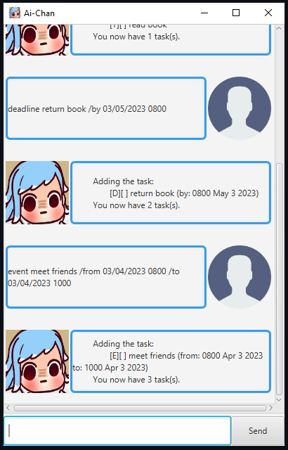

# User Guide

**MEL** is your friendly personal assistant chatbot that can help you keep track of your daily tasks.

## Quick Start
1. Ensure you have `Java 11` or above installed in your computer.
2. Download the latest `MEL.jar`.
3. Copy the file to the folder you want to use as the *home folder* for MEL.
4. Open a command terminal in the current folder directory 
5. Run `java -jar MEL.jar` command to run the application!

## Features 

### Add Task

There are 3 different type of tasks available.

#### **To do**: `todo [task]`

#### **Deadline**: `deadline [task] /by [YYYY-MM-DD]`

#### **Event**: `event [task] /from [YYYY-MM-DD] /to [YYYY-MM-DD]`

### List: `list`

List out all tasks saved.

### Mark/Unmark Task: `mark [task #]` or `unmark [task #]`

Mark/unmark a task as done/not done.

### Delete Task: `delete [task #]`

Delete task from list.

### Find Task: `find [keyword]`

Find task(s) by searching for a keyword.

### Help: `help` or `help [command]`

Provide in-App guidance to users.

