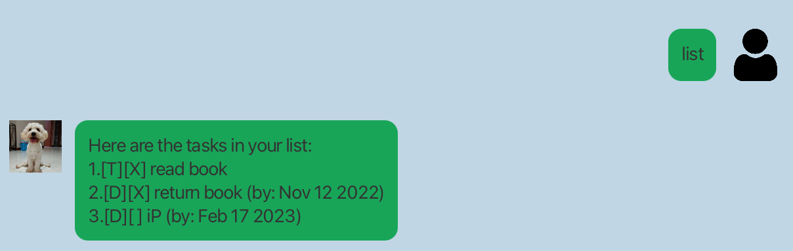
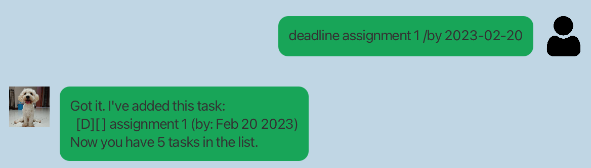
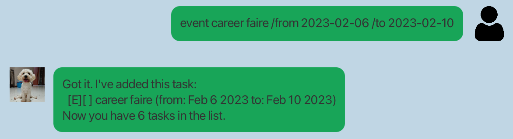
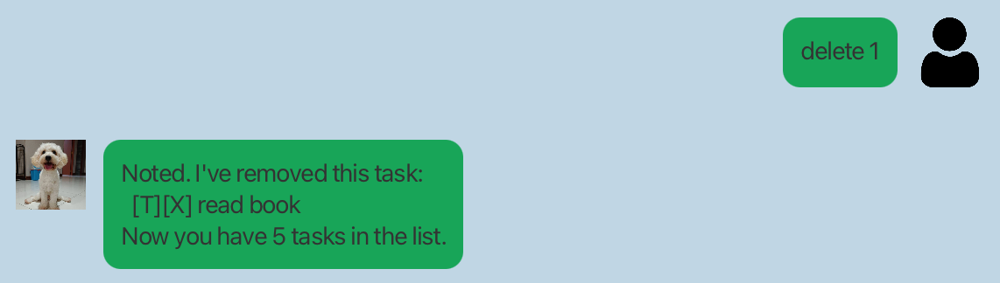
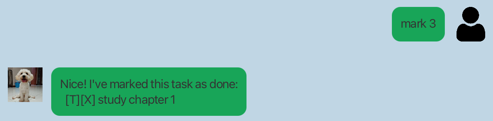
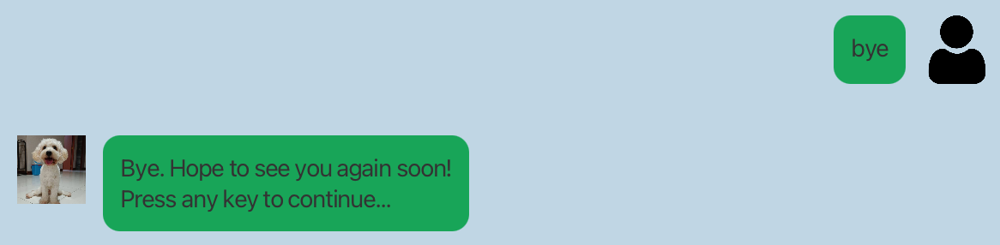

# User Guide

## Dudu

> Dudu is a task manager which help you to keep track of your todo, deadline and event tasks

## Features 
<hr/>


## Usage

### `hi` - Greeting to Dudu 

> Send a greeting to Dudu, and Dudu will request for your service.

Example of usage: 

`hi`

Expected outcome:

Dudu should send you the following

```
Hello! I'm Dudu
What can I help you?
```


<hr/>

### `list` - List down all the tasks

> Dudu will send you a list containing all the saved task.

Example of usage:

`list`

Expected outcome:

Dudu should send you the following

```
Here are the tasks in your list:
1.[T][X] read book
2.[D][X] return book (by: Nov 12 2022)
3.[D][ ] iP (by: Feb 17 2023)
```



<hr/>

### `todo [DESCRIPTION]` - Add a TODO task

> Dudu will help you add the todo task to the list, and tells you the total number of tasks you have.

Example of usage:

`todo study chapter 1`

Expected outcome:

Dudu should send you the following

```
Got it. I've added this task:
  [T][ ] study chapter 1
Now you have 4 tasks in the list.
```


<hr/>

### `deadline [DESCRIPTION] /by [yyyy-MM-dd]` - Add a DEADLINE task

> Dudu will help you add the deadline task to the list, and tells you the total number of tasks you have.

Example of usage:

`deadline assignment 1 /by 2023-02-20`

Expected outcome:

Dudu should send you the following

```
Got it. I've added this task:
  [D][ ] assignment 1 (by: Feb 20 2023)
Now you have 5 tasks in the list.
```


<hr/>

### `event [DESCRIPTION] /from [yyyy-MM-dd] /to [yyyy-MM-dd]` - Add a EVENT task

> Dudu will help you add the event task to the list, and tells you the total number of tasks you have.


Example of usage:

`event career faire /from 2023-02-06 /to 2023-02-10`

Expected outcome:

Dudu should send you the following

```
Got it. I've added this task:
  [E][ ] career faire (from: Feb 6 2023 to: Feb 10 2023)
Now you have 6 tasks in the list.
```


<hr/>

### `delete [INDEX]` - Delete a task

> Dudu will help you delete a task denoted at the index.

Example of usage:

`delete 1`

Expected outcome:

Dudu should send you the following

```
Noted. I've removed this task:
  [T][X] read book
Now you have 5 tasks in the list.
```


<hr/>

### `mark [INDEX]` - Mark a task as DONE

> Dudu will help you mark your task denoted at the index to DONE

Example of usage:

`mark 3`

Expected outcome:

Dudu should send you the following

```
Nice! I've marked this task as done:
  [T][X] study chapter 1
```


<hr/>

### `unmark [INDEX]` - Mark a task as UNDONE

> Dudu will help you mark your DONE task denoted at the index to UNDONE

Example of usage:

`unmark 3`

Expected outcome:

Dudu should send you the following

```
OK, I've marked this task as not done yet:
  [T][ ] study chapter 1
```


<hr/>

### `find [KEYWORD]` - Find a task

> Dudu will help you find the tasks associated with the keyword

Example of usage:

`find study`

Expected outcome:

Dudu should send you the following

```
Here are the matching tasks in your list:
1.[T][ ] study chapter 1
```
<hr/>


### `bye` - Exit application

> Send a goodbye to Dudu, eventually Dudu will go to rest

Example of usage:

`bye`

Expected outcome:

Dudu should send you the following

```
Bye. Hope to see you again soon!
Press any key to continue...
```
