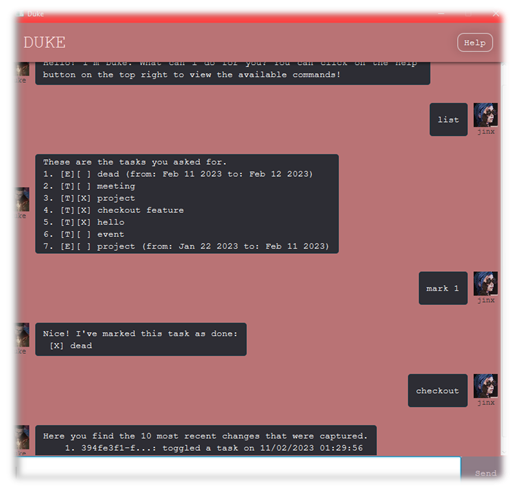

# User Guide
Duke Task Manager is a **desktop application for managing your tasks via a Command Lind Interface** (CLI) with a simple 
Graphical User Interface (GUI) for users that are not familiar with Terminal.

***
## Quick Start
1. Ensure you have Java 11 or above installed in your computer, you can install it from [here]
   (https://www.oracle.com/java/technologies/downloads/#java11).
2. Download the latest duke.Duke.jar from [here](https://github.com/se-edu/addressbook-level3/releases).
3. Copy the file to the folder you want to use as the home folder for your Duke.
4. Open a command terminal. `cd` into the folder you put the jar file in, and use the `java -jar duke.Duke.jar` command to run the application. A GUI similar to the below should appear in a few seconds. 
      
5. Type the command in the input box and press `Enter`.    Some example commands you can try:
* `list` : Lists all tasks.
* `todo Buy Bread` : Adds a task to `Buy bread` to the Task Manager.
* `delete 3` : Deletes the 3rd task shown in the current list.
* `mark 3` :  Marks the 3rd task shown as done in the current list.
* `find bread` : Lists all tasks with the keyword bread.
* `undo` : Undos the most recent command if possible.
* `bye` : Exits the app.
6. Refer to the below for details of each command.

***
## Features
### Show all tasks: list
Displays all tasks. 
Format: `list`

### Adding a to do task: `todo`
Adds a to do task. 
Format: `todo [task]` 
Examples:
- `todo Buy Bread`

### Adding a deadline task: `deadline`
Adds a task with a deadline. 
Format: `deadline [task] /by [YYYY-MM-DD]` 
Examples:
- `deadline do math homework book /by 2023-03-01`

### Adding an event task: `event`
Adds an event task. 
Format: `event [task] /from [YYYY-MM-DD] /to [YYYY-MM-DD]` 
Examples:
- `event math camp /from 2023-03-01 /to 2023-03-04`

### Marking/unmarking a task: `mark` or `unmark`
Marks/unmarks a task as done. 
Format: `mark [index]`  `unmark [index]`  
- Marks/unmarks the task at the specified `index`. The index refers to the index number shown in the task list. 
- The index **must be a positive integer** 1, 2, 3, ...
  Examples:
- `mark 1`
- `unmark 2`

### Searching for tasks: `find`
Find tasks whose description contains the keyword. Search is case-insensitive 
Format: `find [keyword]` 
  Examples:
- `find bread` returns `[T][ ] Buy Bread`
   

### Deleting a task: `delete`
Deletes the task at the specified index. 
Format: `delete [index]` 
- Deletes the task at the specified `index`. The index refers to the index number shown in the task list.
- The index **must be a positive integer** 1, 2, 3, ...
  Examples:
- `delete 1`
   

### Undo a task: `undo`
Undo the most recent task. 
Format: `undo` 
- Reverses a task, eg, adds a task back to the list or unmarks a task that was previously marked.
- If task is one that cannot be undo-ed, eg list, find, bye, an error message will be shown.
  Examples:
- `undo`

### Exiting the program: `bye`
Exits the program. 
Format: `bye`
 