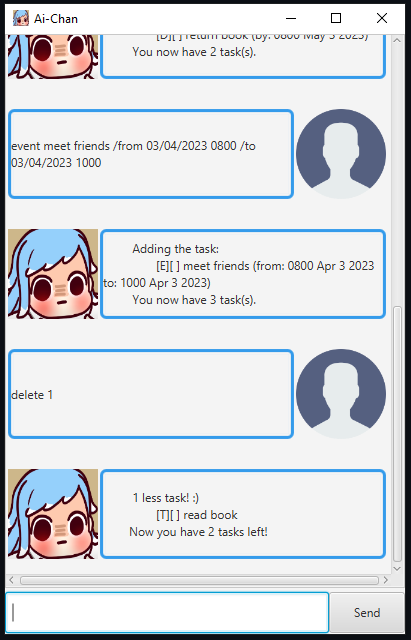
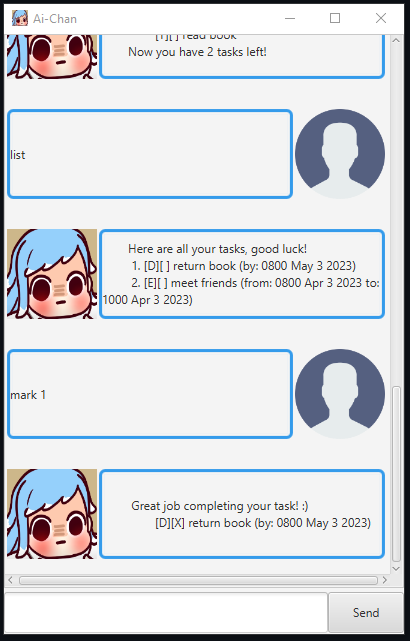
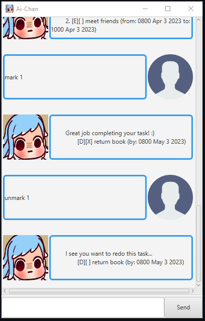
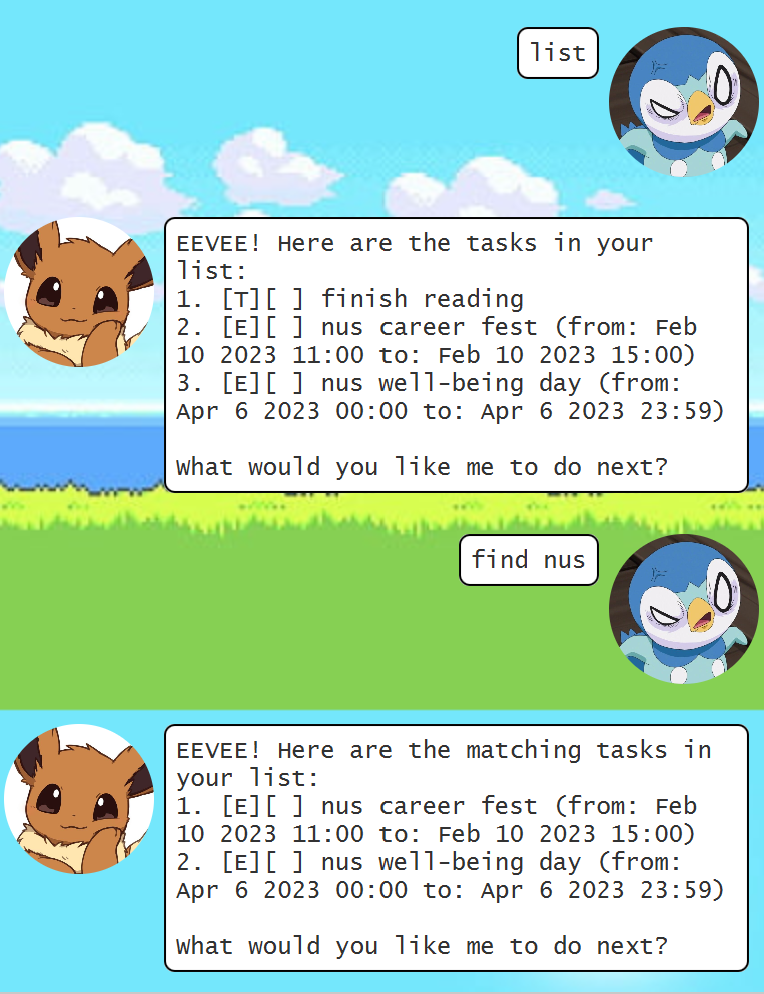

# User Guide

## Description
A virtual assistant for tracking tasks.


## Features
### Adding Task
- You can add as a task of 3 possible types, Todo/Event/Deadline to `duke.txt`.

### Delete Task
- You can delete tasks from the list.

### List Task
- You can list all tasks.

### Find Task
- You can find your task by title.

### Sorting tasks
- Your tasks will be stored onto hard disk in the file `duke.txt` in the `data` folder. 
- Data from this file will be loaded upon start up.

### Exit the program
- You can close the GUI by typing `bye`.

## Usage
### `todo` - Add todo to the list
Inform Ai-chan to add a todo with description provided.

To add a **Todo**, type in 
```
todo {title}
```
Example of usage:
```
todo read book
```
Expected Outcome:


### `deadline` - Add deadline to the list
Inform Ai-chan to add a deadline with description and date provided.

To add a **Deadline**, type in 
```
deadline {title} /by {date}
```
where date is in the format `dd/MM/yyyy HHmm`

Example of usage:
```
deadline return book /by 03/05/2023 0800
```

Expected Outcome:


### `event` - Add event to the list
Inform Ai-chan to add a event with description and start and end date provided.

To add an **Event**, type in 
```
event {title} /from {date} /to {date}
```
where date is in the format `dd/MM/yyyy HHmm`

Example of usage:
```
event meet friends /from 03/04/2023 0800 /to 03/04/2023 1000
```

Expected Outcome:


### `delete` - delete item from list
Inform Ai-chan to delete a task at index provided.

To **delete** a task, 
```
delete {index}
```
Example of usage:
```
delete 1
```

Expected Outcome:


### `list` - list all items
Inform Ai-chan to list all tasks.

To **list** all available tasks,
```
list 
```

Expected Outcome:


### `mark` - mark an item as done
Inform Ai-chan to mark a task as done.

To **mark** a task, 
```
mark {index}
```
Example of usage:
```
mark 1
```

Expected Outcome:


### `unmark` - unmark an item 
Inform Ai-chan to unmark a task that was previously marked as done.

- To **unmark** a task, 
```
unmark {index}
```
Example of usage:
```
unmark 1
```

Expected Outcome:


### `find` - find a task
Inform Ai-chan to find tasks whose title match the search term.

- To **find** tasks, 
```
find {search term}
```
Example of usage:
```
find book
```

Expected Outcome:


### Storing tasks
Your tasks will automatically be stored in a `duke.txt` file found in the `data` folder.

Example of data stored on file:
```
[D] | 0 | return book | 03/05/2023 0800
[E] | 0 | meet friends | 03/04/2023 0800-03/04/2023 1000

```

### Exit the program
Say goodbye to Ai-chan and exit the program.

Example of usage:
```
bye
```

Expected Outcome:
Program will close.

## Acknowledgements
Credit to Zetta Zero for the [art](https://www.youtube.com/watch?v=1A5lRjr4bDg&ab_channel=ZettaZero) for Ai-chan
