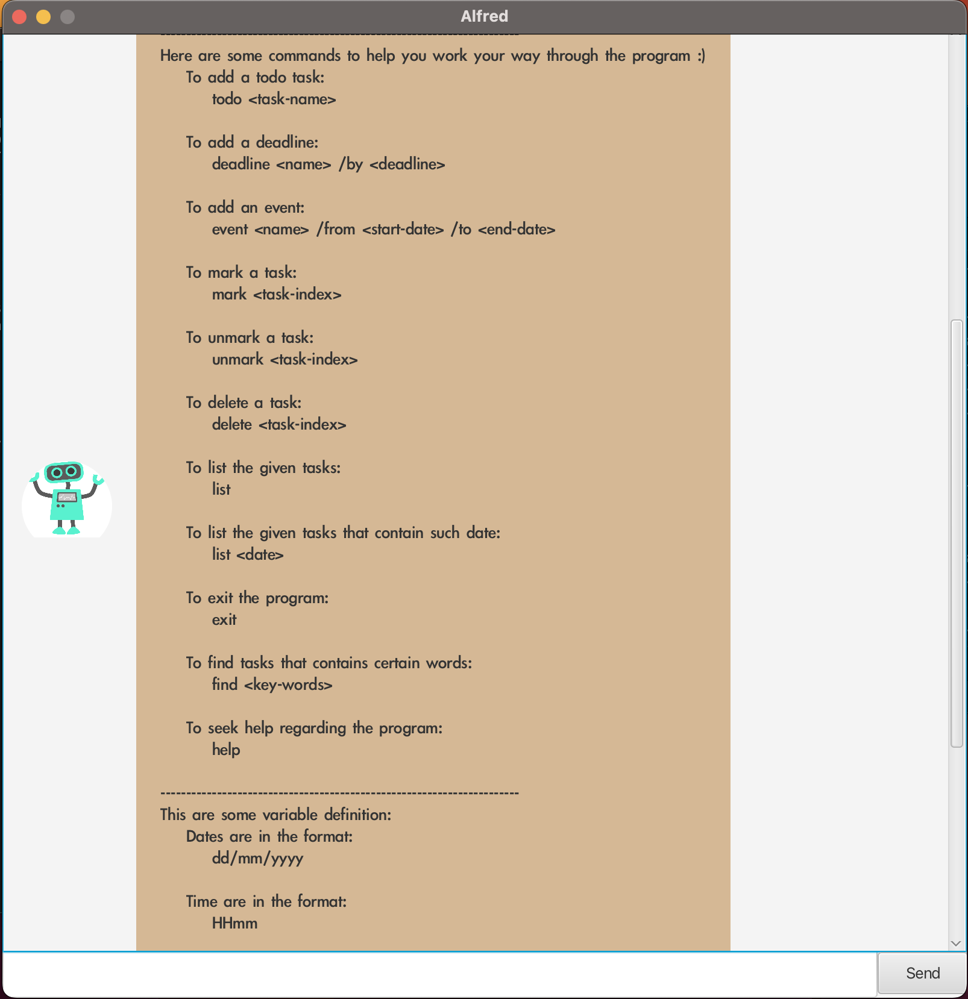

# User Guide
> Alfred is a desktop application that has a personal assistant named Alfred to help users keep track
> of various things such as deadlines. It has a simple Graphical User Interface (GUI) that is optimised
> for users who can type fast, imitating the benefits of a Command User Interface (CLI). 

## Quick Start
1. Ensure that you have Java `11` or above installed in your computer.
2. Download the latest `alfred.jar` from [here](https://github.com/pangrwa/ip/releases).
3. Copy the file to the folder you want to use as the home folder for Alfred.
4. Open a command terminal, cd into the folder you put the jar file in, and use the `java -jar alfred.jar` 
command to run the application.

    A GUI similar to the below should appear in a few seconds. 
5. Type `help` to get a list of commands for you to use. 
6. Refer to features for more explanation.
## Features 
### :white_check_mark: Notes about format:
- Words in `UPPER_CASE` are the parameters to be supplied by the user.
  e.g. `todo TASK`, `TASK` is a parameter which can be used as `todo return book`.
- Dates should be in the format `dd/mm/yyyy`.
- Time should be in the format `HHmm`.

### Viewing Help: `help`
Shows a message that contains all the commands available in the program.

### Adding a todo: `todo TASK`
Adds a todo task to the program.
- Eg: `todo return book`

### Adding a deadline: `deadline TASK /by DATE`
Adds a deadline task to the program.
- Eg: `deadline return book /by 12/12/2023 1200`

### Adding an event: `event TASK /from START-DATE /to END-DATE`
Adds an event to the program.
- Eg: `event meet friends /from 12/12/2023 1200 /to 12/12/2023 1400`

### Listing all tasks: `list`
Lists all the tasks in the program.
- Eg: `list`

### Listing all tasks that include a date: `list DATE`
Lists all the tasks in the program that contains the given date.
- Eg: `list 12/12/2023`

### Marking a task: `mark INDEX`
Marks a task given the index of the task.
- Eg: `mark 1` - marks the first task in the list as done

### Un-marking a task: `unmark INDEX`
Un-mark a task given the index of the task.
- Eg: `unmark 1` - un-marks the first task in the list

### Finding tasks: `find KEY-WORDS`
Find tasks that contains the given key-words.
- Eg: `find return` - returns all the tasks that contains the word `return`

### Deleting a task: `delete INDEX`
Delete a task given the index of the task.
- Eg: `delete 1` - deletes the first task in the list

### Closing the program: `bye`
Closes the program
- Eg: `bye`

## Usage

### `deadline` 
Adds a deadline task to the program.

Example of usage: `deadline return book /by 12/12/2023 1200` 

Expected outcome: 
- Adds a deadline into the task list

### `event`
Adds an event task to the program.

Example of usage: `event meet friends /from 12/12/2023 1200 /to 12/12/2023 1400`

Expected outcome: 

### `list`
Lists all the tasks in the program.

Example of usage: `list`

Expected outcome: 

### `list DATE`
Lists all the tasks in the program that contains the given date.

Example of usage: `list 12/12/2023`

Expected outcome: 

### `find KEY-WORD`
Find tasks that contains the given key-words.

Example of usage: `find return`

Expected outcome: 