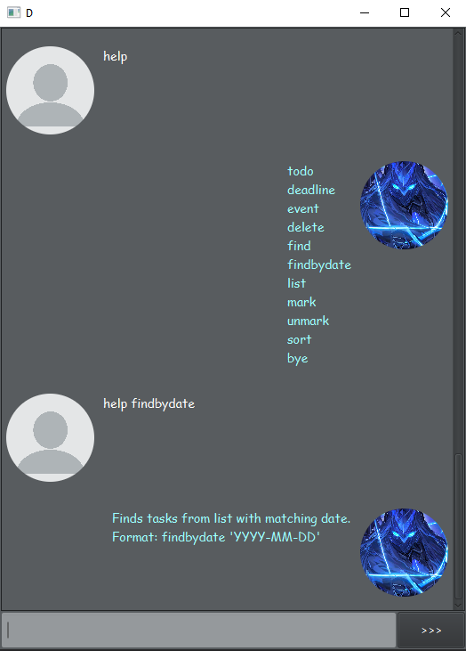

# User Guide

## Features

Are you tired of feeling overwhelmed by your daily tasks, deadlines, and events? Introducing Duke, the ultimate Todo, Deadline, and Event manager!

With Duke, you can easily organize your schedule and stay on top of your to-do list. Create tasks and set deadlines, and never miss an important event again.

## Quick Start

1. Ensure that you have Java 11 or above installed.
1. Down the latest version of `Duke` from [here](https://github.com/francisyzy/ip/releases).

## Features

### Adding a todo: `todo`

Adds a new item to the list of todo items.

Format: `todo task_title`

- The `task_title` can contain any string.

Example of usage:

`todo eat a cake`

`todo work on tutorial`

### Adding a deadline: `deadline`

Adds a new item to the list of todo items.

Format: `deadline task_title /by YYYY-MM-DDTHH:MM`

- The `task_title` can contain any string.
- The `/by` can only be inputted using ISO 8601 format.

Example of usage:

`deadline submit ip /by 2023-02-16T12:30`

`deadline buy flowers /by 2023-02-14T18:30`

### Adding a event: `event`

Adds a new item to the list of todo items.

Format: `event task_title /from YYYY-MM-DDTHH:MM /to YYYY-MM-DDTHH:MM`

- The `task_title` can contain any string.
- The `/to` can only be inputted using ISO 8601 format.
- The `/from` can only be inputted using ISO 8601 format.

Example of usage:

`event pokemon community day /from 2023-03-18T14:00 /to 2023-03-18T17:00`

`event apple keynote /from 2023-04-14T18:30 /to 2023-04-14T20:30`

### Feature-A-Personality

The user can set Duke to a few select funny languages! Try it out! `set LOLCAT` or `set` to view the list!

### Feature-C-Help

When the user types `help`, they are greeted with a list of commands and sample usage.

They can then type `help todo` to find out more about the todo command

### Feature-Export

You can export the tasks as a list of items in markdown format! So you can use it in your github issues to keep track of tasks todo!

## FAQ

**Q**: How do I transfer my data to another computer?

**A**: Your data is saved in a file next to the jar file! It will be saved as `duke_data.txt`. You may transfer the file around to keep track of your tasks

## Command Summary

- todo
  - todo 'name'
  - To add a task with only a name.
- deadline
  - deadline 'name' /by 'date'
  - To add a task with a deadline.
- event
  - event 'name' /from 'date' /to 'date'
  - To add an event with start and end time.
- mark
  - mark 1
  - To mark a task as done by specifying its number.
- unmark
  - unmark 1
  - To unmark a task as not done by specifying its number.
- delete
  - delete 1
  - To remove a task by specifying its number.
- del
  - del 1
  - To remove a task by specifying its number.
- find
  - find 'name'
  - To find tasks with a specified name.
- set
  - set 'language'
  - To set language for duke.
- list
  - list
  - List out the tasks in the task list
- clear
  - clear
  - Clears the task list
- export
  - export
  - To export tasks to a markdown file
- bye
  - bye
  - To exit duke.
- exit
  - exit
  - To exit duke.
- help,
  show this message,
  To show the available commands and explanations.);
