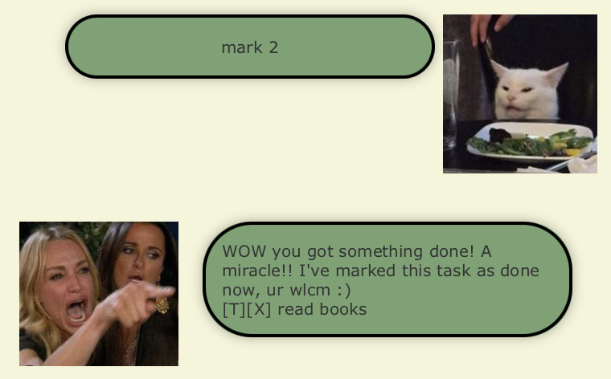

<orange> <h1>User Guide</h1> </orange>

DukePro is a **desktop app for tracking your events,
deadlines and todos**, then yells at you to get it done.

- [Features](#features)
    * [Adding a task: `todo`, `deadline`, `event`](#adding-a-task---todo----deadline----event-)
    * [Listing all tasks: `list`](#listing-all-tasks---list-)
    * [Marking a task as done: `mark`](#marking-a-task-as-done---mark-)
    * [Marking a task as undone: `unmark`](#marking-a-task-as-undone---unmark-)
    * [Deleting a task: `delete`](#deleting-a-task---delete-)
    * [Filtering tasks by date: `date`](#filtering-tasks-by-date---date-)
    * [Finding a task by keyword: `find`](#finding-a-task-by-keyword---find-)
    * [Exiting DukePro: `bye`](#exiting-dukepro---bye-)
- [Command Summary](#command-summary)

<small><i><a href='http://ecotrust-canada.github.io/markdown-toc/'>Table of contents generated with markdown-toc</a></i></small>

## Features

> >Notes:
> - Words in `UPPER_CASE` are parameters to be supplied by the user.

### Adding a task: `todo`, `deadline`, `event`

Add a task by specifying its type.
Format:
- `todo SOME_TASK`
- `deadline SOME_DEADLINE /by DD/MM/YYYY HH:SS`
- `event SOME_EVENT /from DD/MM/YYYY HH:SS /to DD/MM/YYYY HH:SS`

### Listing all tasks: `list`
Shows all tasks in the task list.  
Format: `list`  
>Example:  
> 

### Marking a task as done: `mark`
Marks the task of given index as done.  
Format: `mark INDEX`  

>Example:
> - `mark 2` marks the second task on the list as done. You will see the task marked as done after calling `list` 
> 
> 

### Marking a task as undone: `unmark`
Marks the task of given index as undone.  
Format: `unmark INDEX`

>Example:
>- `unmark 2` marks the second task on the list as not done.

### Deleting a task: `delete`
Deletes the task of given index.  
Format: `delete INDEX`

>Example:
>- `delete 2` deletes the second task on the task list.

### Filtering tasks by date: `date`
Filters events and deadlines occurring on a given date.  
Format: `date DD/MM/YYYY`

>Example:
>- `date 12/02/2023` lists all deadline due on 12/02/2023 and events happening on 12/02/2023.

### Finding a task by keyword: `find`
Finds and shows all tasks that contain a given keyword.  
Format: `find KEYWORD`

>Example:
>- `find book` lists all tasks that contain the word "book"  
> 
> 

### Exiting DukePro: `bye`
Exits the chat.  
Format: `bye`

## Command Summary

| Action          | Format                                                                                                                                      |
|-----------------|---------------------------------------------------------------------------------------------------------------------------------------------|
| Add Task        | - `todo SOME_TASK`  - `deadline SOME_DEADLINE /by DD/MM/YYYY HH:SS`  - `event SOME_EVENT /from DD/MM/YYYY HH:SS /to DD/MM/YYYY HH:SS` |
| List Tasks      | `list`                                                                                                                                      |
| Mark Task       | `mark INDEX`                                                                                                                                |
| Unmark Task     | `unmark INDEX`                                                                                                                              |
| Delete Task     | `delete INDEX`                                                                                                                              |
| Find by Date    | `date DD/MM/YYYY`                                                                                                                           |
| Find by Keyword | `find KEYWORD`                                                                                                                              |
| Exit            | `bye`                                                                                                                                       |

