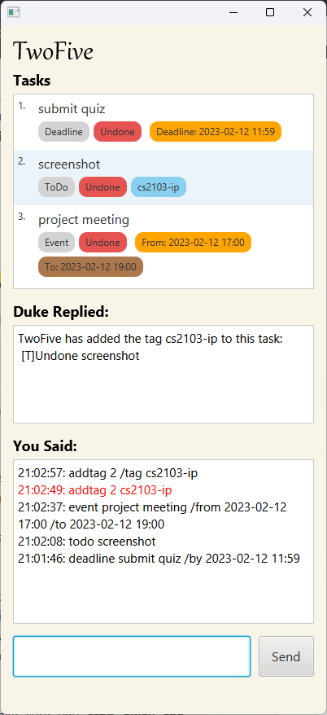

# DOOK

## Quick start

1. Ensure you have Java `11` or above installed in your Computer.

1. Download the latest `dook.jar` from [here](https://github.com/iapetusbob/ip/releases).

1. Copy the file to the folder you want to use as the _home folder_ for your DOOK.

1. Open a command terminal, `cd` into the folder you put the jar file in, and use the `java -jar dook.jar` command to run the application. 
   A GUI similar to the below should appear in a few seconds. Note how the app contains some sample data. 
   

1. Type the command in the command box and press Enter to execute it. e.g. typing **`help`** and pressing Enter will show all the commands at your disposal. 
   Some example commands you can try:

   * `list` : Lists all contacts.

   * `add todo Buy Carrots` : Adds a task of type *Todo* called **Buy Carrots** to the list.

   * `delete 3` : Deletes the 3rd task hown in the tasklist.

   * `bye` : Saves the current tasklist into the harddrive for next boot up of DOOK.

1. Refer to the [Features](#features) below for details of each command.

## Features:

### Viewing help : ``help``

Brings users to the help page.

Format: ``help``

### Adding a task: ``add``

Adds a task to the list.

Format: ``add <taskType> <task>``

Examples:

``add todo buy onions and garlic``

``add event Jack Birthday Party /from 10/10/23 1700 /to 10/10/23 2200``

### Listing all tasks : ``list``

Shows a list of all tasks in the list.

Format: ``list``

### Finding via keywords : ``find ``

Finds tasks in the list with sepcified keywords.

Format: ``find <keyword 1> <keyword 2> <...>``

Examples :

``find buy marked``

### Marking tasks : ``mark ``

Marks the task at specified index as done.

Format : ``mark <index>``

Examples :

``mark 2``

### Unmarking : ``unmark``

Unmarks the task with specified index.

Format : ``unmark 2``

### Deleting a person : ``delete``

Deletes the specified task from the list.

Format: ``delete``

### Saving the data : ``bye``

Saves the current list for next bootup of DOOK.

Format : ``bye``
